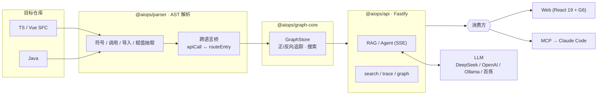

# 逻瞳 · Code Intelligence Platform

> 把一个代码仓库解析成**可追踪的知识图谱**，用自然语言问出「这段逻辑从哪来、到哪去」，并把同样的结构化事实开放给 IDE 里的 AI 编程助手。

<p>
  
  
  
  
  
  
</p>

---

## 一句话定位

逻瞳（Logipulse）是一个**以结构态分析为内核、自然语言问答为入口**的代码智能平台。它不依赖运行时日志，而是通过多语言 AST 把代码静态解析成「节点 + 关系」的知识图谱，再在图谱之上提供三类消费方式：

- **人**：在 Web 端用中文提问，Agent 自动检索图谱、读源码、给出带定位的回答；
- **AI**：通过 MCP 协议，把精确的符号位置与调用链开放给 Claude Code 等编程助手，让它不再靠 `grep` 逐文件猜；
- **接口**：以 HTTP API 暴露搜索 / 正向追踪 / 反向追踪 / 图谱统计，可被任意上层工具集成。

---

## 为什么做这件事

排查「点这个按钮，最后改了哪张表」这类问题，传统方式是全文搜索 + 逐文件跳转，跨前后端、跨语言时尤其费时。逻瞳把这件事变成一次图遍历：

| 痛点 | 逻瞳的做法 |
|------|-----------|
| 关键字搜索命中一堆同名符号 | AST 解析得到带作用域的精确符号与文件位置 |
| 调用链要靠人脑在文件间跳 | 图谱预存 `calls / imports / implements / injects` 等关系，正反向一跳到底 |
| 前端调 API、后端收请求，两段断开 | **跨语言桥**按 endpoint 归一，自动连上 `apiCall → routeEntry`，一条链打通前后端 |
| AI 助手只会 grep + 猜 | MCP 把结构化事实喂给它，回答有出处 |

---

## 核心能力

### 1. 多语言代码知识图谱

- **TypeScript / Vue SFC**：基于 TypeScript Compiler API + `@vue/compiler-sfc`，提取函数、组件、API 调用、状态流、路由等节点及其关系。
- **Java**：基于 tree-sitter（运行时走 `web-tree-sitter` wasm，无需 C++ 工具链），支持构造器注入、接口实现 Top-N 扇出、多模块 Maven/Gradle 布局整仓扫描。
- **可插拔语言注册表**：`languages/registry.ts` 统一接入新语言，解析器与抽取器分层（`extractors/` 负责函数 / 调用 / 导入 / 赋值抽取）。

### 2. 跨语言调用链桥（亮点）

`crossLanguage.ts` 在单语言解析之上做编排：把前端 `apiCall` 与后端 `routeEntry` 按归一化的 endpoint key 配对，产出实体边 `apiCall --calls--> routeEntry`。于是「前端某次请求 → 后端哪个 handler → 它又调用了谁」可以在**同一张图**里一次遍历完成 —— 这是纯单语言解析器做不到的全栈追踪。

### 3. 自然语言问答 + ReAct Agent

- **意图分类**：自研 NLP 管线识别 9 类意图（UI 条件、点击链路、数据来源、API 用法、状态流、组件关系、页面结构、错误链路、通用）。
- **ReAct Agent**：`agent/agentLoop.ts` 跑「思考→调用工具→观察」循环，使用 OpenAI 兼容的 tool calling，工具结果按请求缓存、内置死循环防护与多级超时控制。
- **SSE 流式**：`POST /api/agent/ask` 以 Server-Sent Events 推送 thinking / tool / result / answer / done 事件，前端实时渲染。

### 4. MCP 服务 —— 把代码图谱接进 Claude Code

`@aiops/mcp` 是一个轻量 stdio MCP 服务，向 Claude Code 暴露 10 个工具（`repo_status` / `explain_code_logic` / `prepare_fix_context` / `get_impact_scope` / `propose_patch` / `search_symbols` / `get_symbol` / `trace_callees` / `trace_callers` / `get_file_graph`）——**全部只读**：`propose_patch` 只产出经 `git apply --check` 验证过的修改提案，落盘与回滚需在 Web 端经人工审批，MCP 侧不暴露写操作。除底层符号/调用链原子工具外，还提供任务级封装：`prepare_fix_context` 产出"改代码前"的结构化修改上下文，`get_impact_scope` 一屏合并上下游影响面。它本身不做分析，而是转发给分析 API 并把结果整理成紧凑文本，让 AI 助手拿到**精确的结构性事实**而非猜测。详见 [`apps/mcp/README.md`](apps/mcp/README.md)。

### 5. 对话持久化与记忆

- SQLite 持久化多轮对话（`db/conversationStore.ts`），刷新 / 切换不丢上下文；
- 记忆模块（`db/memoryStore.ts` + `services/memoryService.ts`）沉淀跨会话的事实，Web 端提供会话侧栏与记忆面板。

### 6. 图谱可视化与多仓管理

- 基于 AntV G6 的交互式关系图，支持正向 / 反向追踪与邻居展开；
- 隔离存储多个仓库的索引产物，Web 端一键切换目标仓库。

### 7. 工程化与部署

- pnpm monorepo，TypeScript 严格模式、纯 ESM；Vitest 覆盖解析与图遍历的关键路径；
- 提供 Docker 多阶段构建（api / web / indexer）与 `docker-compose`，容器内保留 workspace 结构以正确解析 `@aiops/*` symlink 与 parser wasm 资产。

---

## 架构总览



**数据流**：索引阶段把仓库解析为 `graph.json / symbolIndex.json / fileIndex.json / apiIndex.json / routeIndex.json / meta.json`（落在 `data/.aiops/{repoName}/`，不入版本控制）→ API 启动载入图谱并构建召回 / 事实 / 页面锚点索引 → 问答 / 追踪 / MCP 在内存图谱上实时响应。

---

## 技术栈

| 层级 | 技术 |
|------|------|
| 前端 | React 19 + Vite + AntV G6（Element Plus 皮肤：内联 theme-chalk 子集 + 同构 React 组件） |
| 后端 | Fastify 5（Node.js，纯 ESM） |
| AST 解析 | TypeScript Compiler API · `@vue/compiler-sfc` · tree-sitter（Java，wasm 运行时） |
| 存储 | SQLite（对话 / 记忆） + JSON 索引产物 |
| NLP | 自研意图分类器（9 类意图） |
| Agent | OpenAI 兼容 tool calling + ReAct + SSE 流式 |
| 集成 | MCP（stdio）对接 Claude Code |
| LLM 接入 | DeepSeek / OpenAI / Ollama / 阿里百炼，可配置切换 |
| 工程 | pnpm monorepo · TypeScript 严格模式 · Vitest · Docker |

---

## Monorepo 结构

```
apps/
  web/        → @aiops/web       React 19 前端（端口 4200）
  api/        → @aiops/api       Fastify API：鉴权 / 项目注册 / 索引 / 图谱 / RAG / Agent / 对话 / 记忆
  indexer/    → @aiops/indexer   CLI 索引工具
  mcp/        → @aiops/mcp       Claude Code 的 stdio MCP 服务（9 个分析工具）

packages/
  shared-types/ → @aiops/shared-types   共享 TS 类型（所有包的基础）
  parser/       → @aiops/parser         多语言 AST 解析 + 跨语言桥 + 索引构建
  graph-core/   → @aiops/graph-core     内存图谱存储与正/反向追踪
  nlp/          → @aiops/nlp            意图分类管线

data/.aiops/{repoName}/                索引产物（git ignored）
docker/                                api / web / indexer 多阶段构建 + compose
```

---

## 快速开始

### 环境要求

- Node.js >= 18 · pnpm >= 8

### 安装与构建

```bash
pnpm install
pnpm build:packages        # 下游 app 依赖此步
```

### 配置环境变量

从 `.env.example` 复制为 `.env`，按需填写：

```env
# 目标仓库
REPO_PATH=/path/to/your/repo
REPO_NAME=my-project

# 服务端口
API_PORT=4201
WEB_PORT=4200

# LLM（以 DeepSeek 为例，亦支持 openai / ollama / 百炼）
LLM_PROVIDER=deepseek
LLM_API_KEY=your_api_key_here
LLM_MODEL=deepseek-v4-flash
LLM_BASE_URL=https://api.deepseek.com

# 访问鉴权（留空则关闭）
AUTH_PASSWORD=
```

### 索引仓库并启动

```bash
pnpm index -- index --repo /path/to/your/repo   # 生成代码图谱
pnpm dev                                         # 全栈并行启动
# 或：pnpm dev:web (→ :4200) / pnpm dev:api (→ :4201)
```

打开 `http://localhost:4200`，在「索引管理」选中仓库后即可在「问答 / 图谱探索」中使用。

### 常用命令

```bash
pnpm typecheck    # 全包类型检查
pnpm test         # Vitest
pnpm build        # 全量构建
```

### Docker 部署

```bash
docker compose -f docker/docker-compose.yml up --build
```

---

## 典型使用流程

1. **索引**：`pnpm index` 把目标仓库解析为知识图谱。
2. **提问**：在 Web 端问「点击保存按钮后数据写到哪」，Agent 分类意图 → 检索图谱 → 读源码 → 流式给出带文件定位的回答。
3. **追踪**：在图谱探索页对任意符号做正向（它调用了谁）/ 反向（谁调用了它）追踪，跨前后端一跳到底。
4. **接进 AI 助手**：配置 `.mcp.json` 后，Claude Code 可直接调用 `trace_callers` / `search_symbols` 等工具拿到精确事实。

---

## 接口与扩展点

### HTTP API（前缀 `/api/`）

| 方法 | 路径 | 说明 |
|------|------|------|
| `POST` | `/agent/ask` | Agent 问答（SSE 流式） |
| `POST` | `/ask` | RAG 问答 |
| `GET` | `/search` | 符号搜索 |
| `GET` | `/trace` · `/why` | 正向 / 反向追踪 |
| `GET` | `/graph/stats` · `/graph/file` · `/graph/symbol` | 图谱统计 / 文件图 / 符号邻居 |
| `GET/POST` | `/conversations` · `/memories` | 对话与记忆 |
| `GET` | `/projects` · `POST /projects/:id/build` | 多仓管理与索引构建 |
| `GET` | `/ws/progress` | WebSocket 索引进度 |

### MCP 工具（对接 Claude Code）

`repo_status` · `explain_code_logic` · `prepare_fix_context` · `get_impact_scope` · `search_symbols` · `get_symbol` · `trace_callees` · `trace_callers` · `get_file_graph` —— 详见 [`apps/mcp/README.md`](apps/mcp/README.md)。

### 前端页面

`/login` 登录 · `/` 首页 · `/answer` 问答 · `/graph` 图谱探索 · `/index-manager` 索引管理。

---

## Roadmap

- [ ] **文档证据通道（进行中）**：在代码图谱之外引入 Markdown 文档的 embedding 检索，让答案层同时融合「代码事实 + 文档语义」。当前已落地类型定义、embedding 服务与文档分块 / 索引构建（`buildDocIndex` + `chunkMarkdown`）；约束是文档**不进**结构态召回，仅在答案层融合，且始终代码优先。
- [ ] 跨语言桥扩展到更多框架与 RPC 形态。
- [ ] 图谱增量更新，避免全量重索引。

---

## License

MIT

## 质量与评测（L1~L4）

问答质量不靠感觉，靠四层可回归的评测/观测（详见 `apps/api/test/eval/README.md` 与同目录 `PRODUCTION-READINESS.md` 审计）：

| 层 | 测什么 | 怎么判 |
|---|---|---|
| L1 检索 | 召回命中该找的文件 | Recall@K / MRR，双门禁：CI fixture 版（永不 skip）+ 本机语义版（断言语义≥词法） |
| L2 引用 | 答案 `file:line` 真实且匹配 | 确定性核对源码（曾抓出 parser 行号偏移真 bug，25%→92%） |
| L3 答案 | 忠实度/正确性/代码优先 | LLM-as-judge 三票 + 确定性陷阱词；`eval -- answers` |
| L4 观测 | 线上链路/延迟/token 成本 | Langfuse 自托管（`docker/langfuse-compose.yml`）+ 抽样 judge 打分回写告警 |

亮点：评测驱动开发全程留痕——RRF 融合（0.556→0.778）、Vue SFC 行号修复、judge prompt 两轮校准，全部由评测数字驱动并验证。
