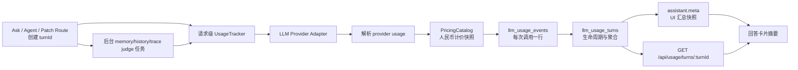

# 生成式 LLM Token 成本追踪设计

> 日期：2026-07-29  
> 状态：**已实施**（阶段 1–5 落地，活体验收见 §21）
> 适用范围：`apps/api`、`apps/web`、`apps/mcp`、`packages/shared-types`
> 计价基线：[DeepSeek 中文官方计价页](https://api-docs.deepseek.com/zh-cn/quick_start/pricing/)（2026-07-29 核验）

## 1. 背景

当前项目已经在普通问答的部分路径读取最近一次 LLM 调用的 token usage，并将 usage 透传给 Langfuse。
但这套机制不能回答“这一轮 Agent 一共花了多少 Token、钱花在哪个阶段、缓存命中了多少”：

- `llmService.ts` 的 `lastCallMeta` 是进程级可变单例，并发请求存在串账风险；
- 普通问答只保留 prompt / completion / total，丢弃 DeepSeek 的缓存命中与未命中字段；
- `agent/llmWithTools.ts` 没有解析 usage，而一次 Agent 请求会触发 planner、N 次 loop、最终回答和反思等多次 LLM 调用；
- `/api/propose-patch` 每次最多调用 LLM 两次，且 prompt 可包含最多 10 个完整文件，是高成本真实路径；
- Ask 的流式调用失败后会重新发起非流式请求，一次回答可能产生两次真实计费；
- 记忆提取、历史摘要等后台任务在回答返回后继续消耗 Token，当前无法归属到触发它们的对话轮次；
- 会话消息没有可持久化的本轮成本汇总，刷新后无法还原；
- Langfuse 适合链路观测，但本地 UI 和可查询的成本事实不能依赖它是否配置。

本设计建立一套本地、请求级、可持久化的 Token 成本追踪机制，并在回答卡片或补丁提案结果中展示。

## 2. 目标

1. 每次 Ask / Agent / propose-patch 与 eval judge 都有稳定 `turnId`，能关联该任务触发的全部 LLM 调用。
2. 每次 LLM 调用记录实际模型、阶段、Token、缓存命中、耗时、状态和人民币成本。
3. Agent 的 planner、每次常规 loop、必要时的强制 final、reflection、后台 memory/history/trace judge
   成本可以分项分析。
4. 回答卡片默认显示本轮摘要，展开后可查看阶段和调用级明细。
5. 回答返回时后台任务尚未结束，卡片显示“成本结算中”；后台完成后更新最终金额。
6. DeepSeek 按官方人民币单价区分缓存命中输入、未命中输入和输出。
7. 价格按调用发生时保存快照；未来调价不重算历史金额。
8. 并发请求不串账，缺失 usage 或单价时不伪装成零成本。
9. 删除会话或项目时清理对应成本数据；极端竞态产生的孤儿记录由启动清扫回收。
10. 中断、后台失败、后台超时或进程重启后仍能得到明确的部分结算结果，不永久停在“结算中”。
11. Web、MCP 与 eval 流量可分组，评测成本不会混入“用户交互成本”。

## 3. 非目标

- 本期不做全局成本 Dashboard、日/月报或预算告警；规范化数据表为后续能力提供基础。
- 本期不做调用限额、熔断或“超过预算自动停止 Agent”。
- 本期不自动抓取 DeepSeek 官网价格；价格通过版本化配置维护。
- 本期不计 embedding 调用成本，只统计对话链路中的生成式 LLM 调用。
- 本期不保存 prompt、回答、reasoning、工具结果或请求头到 usage 表。
- 本期不保证与供应商账单分毫一致；以 API 返回的 usage 和调用时价格快照做可复算的观测级成本。
- 本期不把本地 Ollama 推理记成 `¥0`；未配置本地成本模型时只展示 Token，金额为“单价未配置”。
- 本期不自动清理 usage events；这是为了保留调用级可复算事实。上线后监控行数/文件大小，达到约定阈值后再设计
  “保留 turn 汇总、按天清理旧 events”的独立策略。

## 4. 已确认的产品决策

### 4.1 展示位置

采用“回答卡片内展开”：

- 默认摘要行：本轮 Token、缓存命中率、LLM 调用次数、人民币成本；
- 点击摘要行后在卡片内展开；
- 展开后先按阶段聚合，`agent_loop` 等多调用阶段可继续展开到单次调用；
- 不增加常驻成本侧栏。

### 4.2 展示密度

采用诊断摘要：

```text
18.4k tokens · 缓存 63.6% · 9 次调用 · ¥0.0113
```

后台任务未完成时：

```text
18.4k tokens · 缓存 63.6% · 9 次调用 · ¥0.0113 · 成本结算中
```

存在不完整 usage 或未知单价时必须显式标记：

```text
部分成本 ¥0.0113 · 1 次调用缺少 usage
```

### 4.3 后台成本归属

记忆提取、历史摘要等由本轮触发的后台 LLM 调用计入本轮。

回答不等待后台任务。前端先显示初步汇总，通过轮询获取最终结算结果。

### 4.4 删除语义

删除会话时，在同一数据库事务中删除：

- `messages`
- `llm_usage_events`
- `llm_usage_turns`
- `conversations`

无状态 MCP 调用没有 conversation 归属，不受“删除会话”操作影响；删除项目数据时应同时清理该项目的 usage 数据。
项目删除与 API 启动时各执行一次 orphan sweep；不引入 JSON/SQLite 两阶段生命周期协议。

### 4.5 非对话管线

`/api/propose-patch` 使用 `pipeline='patch'` 创建无 conversation 的 turn。Web 补丁结果页展示同一
`TokenUsagePanel` 摘要；MCP 返回中附加紧凑成本摘要。每次重试分别记录 `patch.propose` event。

## 5. 总体架构



核心原则：

- `llm_usage_events` 是调用级事实源；
- `llm_usage_turns` 是轮次生命周期和聚合事实；
- assistant message `meta` 是面向会话恢复的 UI 缓存副本；
- Langfuse 继续接收 usage，但不是本地成本功能的依赖；
- 不继续使用进程级 `lastCallMeta` 做请求归属。

## 6. 请求级 UsageTracker

### 6.1 显式传递，不使用全局上下文

每个 Ask / Agent 路由在解析项目与会话后创建一个 `UsageTracker`。所有会触发 LLM 的函数显式接收
`usageContext`：

```ts
interface LlmUsageContext {
  tracker: UsageTracker
  stage: LlmUsageStage
}
```

选择显式传递而不是 `AsyncLocalStorage`，原因是：

- 后台 fire-and-forget 任务需要明确继承哪个 turn；
- 单测可直接注入 fake tracker；
- stage 标签由调用方决定，显式参数更容易审查；
- 避免异步边界变化后出现隐式归属错误。

低层 LLM 函数保持原有业务返回类型，通过可选 `usageContext` 上报 usage，避免所有调用方改成解包
`{ value, usage }`：

```ts
callChatCompletion(messages, {
  signal,
  usage: { tracker, stage: 'ask.answer_complex' },
})
```

项目注册表的事实源仍是 `projects.json`。本期不新增 `project_lifecycle` guard，也不把项目 CRUD 迁入 SQLite。
成本追踪只做以下低复杂度收口：

- turn 创建前按现有 `resolveActiveProjectId()` 和 registry/current repo 规则校验项目；
- 删除项目时，在现有删除流程末尾按 `project_id` 显式删除 usage events/turns；
- API 启动完成当前 project/repo 解析后，读取 `projects.json` 与当前 legacy id，清扫不属于任何有效项目的
  usage rows；不能在 `currentRepoName` 尚未恢复前提前清扫；
- event 写入仍要求 turn 存在；删除会话/项目后的迟到 event no-op，不重建 turn；
- 极端“删除清理完成后，旧请求才创建 turn”的竞态允许暂存为孤儿，并在下次启动清扫。它不会被当前项目 UI
  查询到；为这个单进程本地工具不引入跨 JSON/SQLite 两阶段提交协议。

初始 turn 事务发生 SQLite I/O、锁超时或损坏时，一次短重试后 fail-open，创建纯内存 degraded tracker：

- 不持久化 conversation/turn，不启动 memory/history 等依赖持久化的回答后任务；
- 仍在内存汇总 provider usage；
- 响应固定携带 `partial=true + tracking_write_failed + droppedUsageRecords`；
- `turnId` 仅用于当前响应，usage endpoint 允许返回 404；
- UI 提示“本轮追踪未持久化，刷新后不可恢复”。

`pipeline` 使用 `ask | agent | patch | eval`，请求来源使用 `web | mcp | eval`。eval runner 必须显式传
`source='eval'`；其直接执行的三票 `judgeAnswer()` 另建 `pipeline='eval'` turn，并用 API answer turnId 作为
可选 parent。成本汇总默认同时提供“全部真实成本”和“排除 eval 的用户交互成本”，不能直接丢弃评测费用。

Agent 已有 options 对象，直接增加 `usage`：

```ts
callChatCompletionWithTools(messages, tools, {
  ...llmOptions,
  usage: { tracker, stage: 'agent.loop' },
})
```

### 6.2 Tracker 生命周期

turn 的“回答执行结果”和“成本是否结算”是两个正交维度，不能再共用一个 `status`：

```text
executionStatus: running -> completed | failed | aborted

settlementStatus: collecting
  ├─ 主链路调用持续记录
  ├─ registerBackground() 增加 pendingJobs
  └─ interactiveDone(executionResult)  // 幂等、exactly once 生效
       ├─ pendingJobs = 0 -> settled
       └─ pendingJobs > 0 -> pending

settlementStatus: pending
  └─ 每个后台任务 finally 调 backgroundDone()
       └─ pendingJobs = 0 -> settled
```

如果用户中断：

- `executionStatus` 标记为 `aborted`；
- 已经收到的 usage 照常记录；
- 没有 usage 的中断调用记录为 `transportStatus=aborted + usageSource=missing`；
- 默认不再登记或启动新的回答后任务；
- 已经开始且已登记的后台任务继续结算，此时允许
  `executionStatus=aborted + settlementStatus=pending`，最后转为 `settled`；
- 即使没有 assistant message，usage turn/event 仍保留，供成本分析。

进程重启时执行恢复扫描：

- 将旧进程遗留的 `executionStatus=running` 改为 `failed`；
- 将所有遗留的 `settlementStatus IN ('collecting', 'pending')` 重新聚合后改为 `settled`；
- `pendingJobs` 清零，并在 `partialReasons` 增加 `process_interrupted`；
- 原本已经是 `aborted` 的执行状态保持不变；
- 恢复更新与 events 最终重算在同一事务完成，避免 turn 永久显示“结算中”。

长跑进程另有 watchdog，不能依赖重启解卡：

- turn 首次进入 `pending` 时写入 `pendingDeadlineAt`；
- 默认超时 10 分钟，可通过 `LLM_USAGE_SETTLEMENT_TIMEOUT_MS` 调整；
- 每分钟扫描一次超过 deadline 的 pending turn，原子清零未完成 job、最终重算、转为 `settled`，并增加
  `partialReasons=settlement_timeout`；
- 每个后台 job 接收 deadline/AbortSignal；watchdog 结算后 job handle 进入 expired，迟到的 `done()` 幂等 no-op；
- 超时后迟到的 LLM event 不再修改已结算 turn；这部分真实成本不可确认，因此 UI 必须维持 partial，而不是
  显示完整成本。

「迟到被拒」必须有量级，不能只留一个布尔 partial（评审补充）：

- watchdog 强制结算与 §10.3 的「event 插入要求 `settlement_status != 'settled'`」是两条独立规则，
  合起来会产生一类**真实花掉、但既不入 event 也不入汇总**的调用：例如超大会话的历史摘要，或排队等槽的
  judge（单次超时上限就有 120s），11 分钟才返回时 turn 早已被 watchdog 结算；
- 这类调用记入 turn 的 `late_dropped_events`，并追加 `partialReasons=late_event_dropped`；
- **不得复用 `droppedUsageRecords`**：后者的语义与 UI 文案是「追踪写入失败」，而这里写入通道完全正常，
  只是 turn 已终结。两者混用会让界面说谎；
- 计数写入走 best-effort 单独事务（只更新计数与 partial reason，不复活 turn、不改 `settled_at`）；
  该事务本身失败时只记日志，不再级联降级；
- UI 在展开区显示「本轮另有 N 次调用因结算超时未计入成本」，摘要行维持 partial 标记。

路由使用一个 `TurnTerminalCoordinator` 覆盖所有出口。成功、业务异常、LLM 异常、提前返回、超时和客户端
abort 最终都必须调用 `finish(executionResult)`；该方法内部对 `interactiveDone(executionResult)` 做幂等
compare-and-set，重复调用返回同一终态而不重复结算。成功路径可以发送 `done`，失败路径保持现有 `error`/
HTTP 错误契约，但仍先把 turn 终结为 `failed` 或 `aborted`。路由的 `try/catch/finally` 必须保证没有出口遗留
`executionStatus=running + settlementStatus=collecting`。

### 6.3 后台任务句柄

后台任务必须先注册，再让主链路进入 `pending`，避免“主链路已结算、后台任务随后才登记”的竞态：

```ts
const job = tracker.registerBackground('background.memory_extract')
void generateMemoriesFromTurn(..., job.usageContext)
  .finally(() => job.done())
```

所有后台任务必须在 `finally` 中释放计数。`job.done(result)` 必须幂等，并在一个事务中原子递减
`pendingJobs`、累计失败数和尝试结算；任务失败不应让 turn 永远停在“结算中”。

当前 Agent 主循环会先发出 `done`，而路由随后才保存 assistant message、登记后台任务。实现时由路由拥有对外
终态：拦截并暂存内部 `done`，按以下顺序处理后再向客户端发送增强后的 `done`：

1. 保存 assistant message，并将 message id 回填到 usage turn；
2. 同步登记本轮所有已知后台任务；
3. 调用 `interactiveDone('completed')`；
4. 读取初步 summary，发送唯一一次对外 `done`；
5. 启动已登记任务；每个任务在 `finally` 中调用 `job.done(result)`。

长期可将 Agent 主循环改成返回 terminal result；在此之前，路由缓冲 `done` 是最小兼容改造。Ask 路由也遵循
同一顺序，禁止“先发送 done、后登记后台任务”。

历史压缩不能继续在 `buildHistoryWindow()` 内部自行 fire-and-forget。将其改为：

```ts
interface PreparedHistoryWindow {
  messages: ChatMessage[]
  startCompaction?: (usageContext: LlmUsageContext) => Promise<void>
}
```

该函数只做是否需要压缩的判定并返回惰性任务，不启动任务。路由仅在 `startCompaction` 存在时登记
`background.history_compact`，传入句柄后再启动，因此“不需要压缩”不会产生 pending job，重复调用也由既有
压缩去重键防止重复任务。

trace 在线判定同样纳入生命周期。`trace.end` 在主链路终态前同步完成采样判定与磁盘缓存查询：

- 未采样或 cache hit：不登记 usage background job；cache hit 可直接复用裁决回写 score；
- 需要真实 LLM：返回惰性的 `startJudge`，路由在终态步骤 2 登记 `background.trace_judge`，并与其他任务
  一起在步骤 5、对外 `done` 之后启动。

不得继续无句柄 fire-and-forget，也不得在统一终态步骤前抢先启动。采样/缓存判定阶段不占用 judge 并发槽或
小时配额。`startJudge` 真正启动时才调用 `acquireJudgeSlot()`：

- 获取失败：job 以 `skipped` 正常完成，0 event、无 partial；
- 获取成功：此时才增加小时计数，并在 judge settle 后释放并发槽；
- 只有实际发起的 judge HTTP 调用才产生 `background.trace_judge` event。

`AskTrace.end()` 从 `void` 改为返回 `PreparedJudgeTask | undefined`；它不再自行启动 Promise。route 根据
`kind='cache_hit' | 'needs_llm'` 执行上述分支，保证任务登记与成本终态只有一个编排者。

## 7. Stage 分类

第一版使用受控字符串联合类型：

```ts
type LlmUsageStage =
  | 'ask.intent'
  | 'ask.question_plan'
  | 'ask.answer_complex'
  | 'ask.answer_complex_fallback'
  | 'ask.answer_simple'
  | 'ask.answer_simple_fallback'
  | 'ask.reflection'
  | 'ask.reflection_retry'
  | 'agent.planner'
  | 'agent.loop'
  | 'agent.reflection'
  | 'agent.reflection_retry'
  | 'agent.final'
  | 'patch.propose'
  | 'eval.judge'
  | 'background.memory_extract'
  | 'background.history_compact'
  | 'background.trace_judge'
```

规则：

- 同一 stage 的多次调用使用 `stageCallIndex` 区分；
- `agent.loop` 表示每次常规 `callChatCompletionWithTools`；调用前无法知道结果是否包含工具，因此无论该响应
  产生工具调用还是直接给出普通最终答案，都归入 `agent.loop`；
- `agent.final` 只表示 `forceFinalAnswer` 发起的独立强制收尾调用，例如达到最大轮次或重复工具调用熔断；
  普通无工具终答不得事后改名为 `agent.final`，也不得重复写 event；
- Ask 主路径使用 `ask.answer_complex`，`composeAnswerWithLlm` 简单定位路径使用 `ask.answer_simple`；
- 流式调用返回空值/异常后重新发起的非流式调用使用对应 `*_fallback` stage。前一次流式调用与 fallback 是两次
  真实供应商请求、两次真实计费，不合并、不去重；若流式末帧未到导致 usage 缺失，前一次 event 标
  `error + usageSource=missing + errorKind=stream_incomplete`；
- `/api/propose-patch` 的每次有界重试均使用 `patch.propose`，按 `stageCallIndex` 区分；
- eval runner 的每张真实 LLM 票使用 `eval.judge`；磁盘缓存已有票不生成 event；
- judge 使用独立模型时记录真实 provider/model；
- `reasoning_tokens` 是 output 的子集，只做诊断展示，不再次计费；
- 后续新增 LLM 调用必须选择或新增 stage，不能用无语义的 `other` 长期兜底。

评审补充：

- **已删除 `ask.doc_validation`**。核查 `services/ask/docRecall.ts` 后确认该路径只调用 `embedText` /
  `getEmbeddingModel`，没有任何 chat completion；而 §3 非目标已明确不计 embedding。保留它会落地成一个
  永不被写入的死枚举值。文档证据通道若将来真的引入生成式校验调用，再按需新增 stage；
- **前瞻（RoadMap T6）**：agent 当前不做 token 级流式，因此没有 `agent.*_fallback`。T6（agent 最终答案改
  token 级流式）落地后，agent 也会出现「流式失败 → 整包重试」的二次真实计费，届时需按 ask 侧同款补
  `agent.loop_fallback` / `agent.final_fallback`，并沿用下面 §11.1 的「由 adapter 状态判定 fallback」规则。

## 8. Provider usage 统一类型

在 `packages/shared-types` 增加：

```ts
interface LlmTokenUsage {
  promptTokens?: number
  cacheHitTokens?: number
  cacheMissTokens?: number
  completionTokens?: number
  reasoningTokens?: number
  totalTokens?: number
}

type UsageSource = 'provider' | 'estimated' | 'missing'
type TransportStatus = 'success' | 'error' | 'aborted'
type LlmPipeline = 'ask' | 'agent' | 'patch' | 'eval'
type LlmRequestSource = 'web' | 'mcp' | 'eval'
type PricingMatchKind = 'exact_model' | 'official_alias' | 'custom_override'
type UsageValidationWarning =
  | 'prompt_cache_mismatch'
  | 'total_token_mismatch'
  | 'reasoning_exceeds_completion'

interface LlmPricingSnapshot {
  currency: 'CNY'
  canonicalModel: string
  inputCacheHitNanoCnyPerToken: number
  inputCacheMissNanoCnyPerToken: number
  outputNanoCnyPerToken: number
  matchKind: PricingMatchKind
  supportsPromptCache: boolean
  catalogVersion: string
  sourceUrl: string
  verifiedAt: string
}

interface LlmCallUsage {
  id: string
  turnId: string
  stage: LlmUsageStage
  stageCallIndex: number
  provider: LlmProvider
  model: string
  canonicalModel: string
  transportStatus: TransportStatus
  usageSource: UsageSource
  deliveryMode: 'stream' | 'non_stream'
  validationWarnings: UsageValidationWarning[]
  tokens: LlmTokenUsage
  pricing?: LlmPricingSnapshot
  cacheHitCostNanoCny?: number
  cacheMissCostNanoCny?: number
  outputCostNanoCny?: number
  totalCostNanoCny?: number
  latencyMs: number
  errorKind?: 'timeout' | 'http_4xx' | 'http_5xx' | 'aborted' | 'network' | 'stream_incomplete' | 'unknown'
  createdAt: number
}
```

usage 表中不保存原始错误响应。`errorKind` 只存受控枚举，避免响应内容或密钥进入观测数据库。

## 9. DeepSeek usage 与人民币计价

### 9.1 官方价格

2026-07-29 核验的人民币价格（每百万 Token）：

| 模型 | 缓存命中输入 | 缓存未命中输入 | 输出 |
|---|---:|---:|---:|
| `deepseek-v4-flash` | ¥0.02 | ¥1 | ¥2 |
| `deepseek-v4-pro` | ¥0.025 | ¥3 | ¥6 |

来源：[DeepSeek 模型 & 价格](https://api-docs.deepseek.com/zh-cn/quick_start/pricing/)。

DeepSeek 上下文缓存默认开启，API usage 会返回：

- `prompt_cache_hit_tokens`
- `prompt_cache_miss_tokens`
- `prompt_tokens`
- `completion_tokens`
- `total_tokens`

缓存规则与字段来源：[DeepSeek 上下文硬盘缓存](https://api-docs.deepseek.com/zh-cn/guides/kv_cache)。

### 9.2 精度

成本使用 nano-CNY 整数（`1 CNY = 1,000,000,000 nano-CNY`），避免极低缓存命中价被四舍五入成零。

每 Token 的整数费率：

| 模型 | hit nano-CNY/token | miss nano-CNY/token | output nano-CNY/token |
|---|---:|---:|---:|
| `deepseek-v4-flash` | 20 | 1000 | 2000 |
| `deepseek-v4-pro` | 25 | 3000 | 6000 |

计算：

```ts
cacheHitCost = cacheHitTokens * inputCacheHitNanoCnyPerToken
cacheMissCost = cacheMissTokens * inputCacheMissNanoCnyPerToken
outputCost = completionTokens * outputNanoCnyPerToken
totalCost = cacheHitCost + cacheMissCost + outputCost
```

UI 展示时除以 `1e9`，使用以下互斥规则：

- `nanoCny === 0`：显示 `¥0`；
- `0 < nanoCny < 1000`（小于 ¥0.000001）：摘要显示 `<¥0.000001`；
- 其他金额：最多保留 6 位小数并移除尾零；
- 展开明细/tooltip 可显示最多 9 位小数，确保 nano-CNY 可复算。

任何正成本都不能因格式化显示成 `¥0`。

### 9.3 模型别名

DeepSeek 官方文档明确说明以下旧名分别对应 `deepseek-v4-flash` 的非思考/思考模式：

- `deepseek-chat`：非思考模式；
- `deepseek-reasoner`：思考模式。

别名价格只能在 `provider='deepseek'` 且规范化 origin 为官方 `api.deepseek.com` 时匹配；custom provider、
代理或其他 base URL 不得仅凭模型字符串套用官方别名价格。别名事件保存
`matchKind='official_alias'`，UI 标“兼容别名计价”，但不把 Token `usageSource` 标成 estimated——usage 是否
精确与价格匹配来源是两个维度。

官方已于 2026-07-24 弃用这两个模型名。项目源码默认值和 README 已是 `deepseek-v4-flash`，实施时还要检查
部署环境/运行时配置；发现旧别名则启动告警并迁移配置，不读取或提交 `.env` 中的密钥。

「规范化 origin」必须给出明确算法，否则最容易出现的故障是**配了官方端点反而匹配不上价格**（评审补充）。
判定只取 scheme + host（忽略端口默认值、path、查询串、大小写与尾斜杠），下列一律视为官方：

| base URL 写法 | 判定 | 说明 |
|---|---|---|
| `https://api.deepseek.com` | ✅ 官方 | 基准 |
| `https://api.deepseek.com/` | ✅ 官方 | 尾斜杠 |
| `https://api.deepseek.com/v1` | ✅ 官方 | 项目实际配置形态（`llmService` 会在其后拼 `/chat/completions`） |
| `https://API.DeepSeek.com/v1` | ✅ 官方 | host 大小写不敏感 |
| `https://api.deepseek.com/beta` | ✅ 官方 | 官方 beta 端点 |
| `https://api.deepseek.com.evil.tld/v1` | ❌ 非官方 | 必须整段 host 相等，禁止后缀匹配 |
| `http://api.deepseek.com` | ❌ 非官方 | 明文 scheme 视为代理改写 |
| 任意内网/代理域名 | ❌ 非官方 | 仅 Token 记录，价格按未知处理 |

host 比较必须是**完整相等**，不能用 `endsWith('deepseek.com')` 之类的后缀判断。

### 9.4 价格目录与快照

新增 `PricingCatalog`：

- 内置经过测试的 DeepSeek CNY 默认价；
- 支持 `LLM_PRICING_CNY_JSON` 覆盖或补充自定义模型；
- 每次调用保存实际使用的价格快照；
- 价格目录必须有 `catalogVersion`、`sourceUrl`、`verifiedAt` 和 `matchKind`；
- 未匹配到单价时 Token 正常记录，成本字段为 `null`，`unknownPricingCalls + 1`；
- 不自动从网页抓价。

### 9.5 缺失缓存字段

若有 `prompt_tokens`，但代理未返回 hit/miss：

- `cacheHitTokens = 0`
- `cacheMissTokens = promptTokens`
- `usageSource = estimated`
- 成本是“全部未命中”的保守上界；
- UI 显示“估算”，不能显示为精确账单。

若 usage 整体缺失：

- `usageSource = missing`
- Token 和成本字段为空；
- 记录模型、阶段、耗时和调用状态；
- 汇总中的 `usageMissingCalls + 1`。

校验：

```text
prompt_tokens 应等于 cache_hit_tokens + cache_miss_tokens
total_tokens 应等于 prompt_tokens + completion_tokens
reasoning_tokens 不得大于 completion_tokens
```

供应商数据不一致时保留原值，并写入 `validationWarnings`；不要静默改写供应商数据。调用事件没有
`partial` 状态，turn 的 `partial` 由 usage 缺失、未知价格、校验告警、追踪写失败、后台失败/超时或进程中断
等原因派生。

### 9.6 对账

价格快照只能证明“当时使用了哪份目录”，不能证明目录或路由一定正确。上线验收与后续月度检查增加人工对账：

1. 选定不跨价格版本的时间窗；
2. 过滤 `provider=deepseek`，分别统计 exact model、official alias 和 eval 流量；
3. 将本地累计 Token/成本与 DeepSeek 控制台的用量或余额变化核对；
4. 记录允许偏差与无法归因流量；量级不一致时暂停把本地金额当作完整账单，优先检查 base URL、alias、价格版本
   与漏接调用路径。

## 10. 数据库设计

SQLite schema 升级到 v6。

### 10.1 `llm_usage_turns`

```sql
CREATE TABLE llm_usage_turns (
  turn_id                   TEXT PRIMARY KEY,
  project_id                TEXT NOT NULL,
  conversation_id           TEXT,
  assistant_message_id      TEXT,
  parent_turn_id            TEXT,
  pipeline                  TEXT NOT NULL,
  source                    TEXT NOT NULL DEFAULT 'web',
  execution_status          TEXT NOT NULL,
  settlement_status         TEXT NOT NULL,
  pending_jobs              INTEGER NOT NULL DEFAULT 0,
  pending_deadline_at       INTEGER,
  call_count                INTEGER NOT NULL DEFAULT 0,
  success_call_count        INTEGER NOT NULL DEFAULT 0,
  error_call_count          INTEGER NOT NULL DEFAULT 0,
  aborted_call_count        INTEGER NOT NULL DEFAULT 0,
  usage_missing_calls       INTEGER NOT NULL DEFAULT 0,
  usage_warning_calls       INTEGER NOT NULL DEFAULT 0,
  unknown_pricing_calls     INTEGER NOT NULL DEFAULT 0,
  dropped_usage_records     INTEGER NOT NULL DEFAULT 0,
  late_dropped_events       INTEGER NOT NULL DEFAULT 0,
  background_failed_jobs    INTEGER NOT NULL DEFAULT 0,
  background_timed_out_jobs INTEGER NOT NULL DEFAULT 0,
  partial_reasons_json      TEXT NOT NULL DEFAULT '[]',
  prompt_tokens             INTEGER NOT NULL DEFAULT 0,
  cache_hit_tokens          INTEGER NOT NULL DEFAULT 0,
  cache_miss_tokens         INTEGER NOT NULL DEFAULT 0,
  completion_tokens         INTEGER NOT NULL DEFAULT 0,
  reasoning_tokens          INTEGER NOT NULL DEFAULT 0,
  total_tokens              INTEGER NOT NULL DEFAULT 0,
  known_cost_nano_cny       INTEGER NOT NULL DEFAULT 0,
  created_at                INTEGER NOT NULL,
  updated_at                INTEGER NOT NULL,
  settled_at                INTEGER
);

CREATE INDEX idx_usage_turn_project
  ON llm_usage_turns(project_id, created_at DESC);

CREATE INDEX idx_usage_turn_conversation
  ON llm_usage_turns(conversation_id, created_at);

CREATE INDEX idx_usage_turn_parent
  ON llm_usage_turns(parent_turn_id, created_at);
```

`known_cost_nano_cny` 是已成功持久化且单价已知调用的成本和。若 `unknown_pricing_calls > 0`、
`usage_missing_calls > 0`、`dropped_usage_records > 0` 或 `late_dropped_events > 0`，它只是已知部分，
UI 必须显示“部分成本”，不能当作完整总价。

三个「不完整」计数的语义**互不重叠**，实现时不得合并（评审补充）：

| 字段 | 含义 | 典型成因 |
|---|---|---|
| `dropped_usage_records` | 调用发生在 turn 存活期，但 usage **写库失败** | SQLite I/O、锁超时、degraded tracker |
| `late_dropped_events` | 写库通道正常，但 turn **已 settled**，event 被拒收 | watchdog 超时结算后才返回的后台调用 |
| `background_timed_out_jobs` | job 句柄被 watchdog 到期释放（**未必产生过 LLM 调用**） | 后台任务卡死或超长 |

`parent_turn_id` 允许悬挂：eval turn 的父 turn 可能随会话删除而消失，而 eval turn 自身没有 conversation、
不会被同一事务清掉。查询端必须容忍父不存在（展示为「父轮次已删除」），**不得用 INNER JOIN 父 turn**，
也不得因此把 eval turn 判为孤儿删除——它仍属于有效项目。

### 10.2 `llm_usage_events`

```sql
CREATE TABLE llm_usage_events (
  id                         TEXT PRIMARY KEY,
  turn_id                    TEXT NOT NULL,
  stage                      TEXT NOT NULL,
  stage_call_index           INTEGER NOT NULL,
  provider                   TEXT NOT NULL,
  model                      TEXT NOT NULL,
  canonical_model            TEXT NOT NULL,
  transport_status           TEXT NOT NULL,
  usage_source               TEXT NOT NULL,
  delivery_mode              TEXT NOT NULL,
  validation_warnings_json   TEXT NOT NULL DEFAULT '[]',
  prompt_tokens              INTEGER,
  cache_hit_tokens           INTEGER,
  cache_miss_tokens          INTEGER,
  completion_tokens          INTEGER,
  reasoning_tokens           INTEGER,
  total_tokens               INTEGER,
  cache_hit_cost_nano_cny    INTEGER,
  cache_miss_cost_nano_cny   INTEGER,
  output_cost_nano_cny       INTEGER,
  total_cost_nano_cny        INTEGER,
  pricing_snapshot_json      TEXT,
  latency_ms                 INTEGER NOT NULL,
  error_kind                 TEXT,
  created_at                 INTEGER NOT NULL
);

CREATE UNIQUE INDEX idx_usage_event_stage_call
  ON llm_usage_events(turn_id, stage, stage_call_index);

CREATE INDEX idx_usage_event_turn
  ON llm_usage_events(turn_id, created_at);

CREATE INDEX idx_usage_event_model_stage
  ON llm_usage_events(canonical_model, stage, created_at DESC);
```

当前项目的 SQLite 层未依赖外键级联，删除语义继续使用显式事务：

- 插入 event 的事务先确认对应 turn 仍存在且未 settled；不存在或已由 watchdog 结算则丢弃迟到事件并记受控
  debug 日志，绝不重建/重开 turn；
- 删除 conversation 时，在同一事务依次删除该 conversation 的 events、turns 和 conversation/messages；
- 删除 project 时，同样显式删除该 project 下的 usage events/turns；
- 正在运行的后台任务晚于删除完成时，迟到 event 因 turn 不存在而 no-op；
- assistant message meta 的 settle 回写也必须先确认 message 仍存在。

启动 orphan sweep 从 `projects.json` 加上当前允许的 legacy project id 构造有效集合，删除集合外 turns 及其
events。有效集合为空时使用专门的全删分支，不能拼接空 `NOT IN ()`。该 sweep 与项目删除后的同步清扫是本期
唯一项目一致性机制。

### 10.3 写入与聚合

记录一次调用时，在同一事务中：

1. 校验 turn 存在且 `settlement_status != 'settled'`，否则 no-op；
2. `INSERT` event；
3. 增量更新 turn 的调用数、Token 和已知成本；
4. 更新 `updated_at`。

`UsageTracker` 的一次调用只能完成一次。唯一索引防止重入重复计费；后台 job handle 的 `done()` 也只能生效
一次，避免重复递减 `pending_jobs`。

聚合使用以下精确定义，不能由各调用方自行判断：

```text
callCount             = COUNT(*)
successCallCount      = COUNT(transport_status = 'success')
errorCallCount        = COUNT(transport_status = 'error')
abortedCallCount      = COUNT(transport_status = 'aborted')
usageMissingCalls     = COUNT(usage_source = 'missing')
usageWarningCalls     = COUNT(validation_warnings_json != '[]')
unknownPricingCalls   = COUNT(usage_source != 'missing' AND total_cost_nano_cny IS NULL)
各 Token 汇总          = SUM(COALESCE(对应字段, 0))
knownCostNanoCny      = SUM(COALESCE(total_cost_nano_cny, 0))
```

因此 `transport_status='success' + usage_source='missing'` 同时计入成功调用和 usage 缺失，不混成第四种调用状态。
`partialReasons` 由受控原因集合派生：

```text
usage_missing
pricing_unknown
provider_usage_inconsistent
tracking_write_failed
background_failed
settlement_timeout
late_event_dropped
process_interrupted
```

usage 追踪写入是 best-effort，但失败不能伪装成完整低成本。`UsageTracker` 在内存中保留
`droppedUsageRecords` 与 `tracking_write_failed`，并遵循：

- event/aggregate 事务失败时，将该次调用计入内存 dropped 计数，不向业务链路抛错；
- 后续写入或终结时，幂等地 best-effort 回写 turn 的 `dropped_usage_records` 和 partial reason；
- 对外 SSE/HTTP summary 合并数据库聚合与内存降级标志，即使回写仍失败也必须显示 `partial=true`、
  `tracking_write_failed` 和“至少有 N 次调用未持久化”，不能将已知部分说成完整总价；
- message meta 回写失败也设置同一降级标志并重试一次；若数据库持续不可用，当前响应仍携带降级摘要，但刷新后
  可能无法恢复，这一限制必须写日志和 trace，不能声称已持久化；
- 最终 events 重算只覆盖可从 events 派生的字段，不得清零已记录的 `dropped_usage_records`。

进入 `settled` 前，从 events 重新聚合并覆盖 turn 汇总，作为最终一致性校验与并发增量修复。最终重算、
`settlement_status='settled'`、`pending_jobs=0`、`settled_at` 和 partial reasons 必须在同一事务提交。后台失败数
来自幂等 job handle，不伪造成 LLM event。恢复事务完成后，若 assistant message 仍存在，还要用同一最终 summary
修补其 meta。验收必须断言：

```text
turn 的调用数、Token、已知成本和 usage 质量计数 = 该 turn 所有 event 按上述谓词重算
turn.backgroundFailedJobs = 该 turn 失败且已完成的后台 job 数
turn.backgroundTimedOutJobs = 该 turn 被 watchdog 到期释放的后台 job 数
turn.lateDroppedEvents      = settled 之后被拒收的 event 数（不参与 events 重算，只能单调累加）
```

### 10.4 message meta

assistant message `meta` 增加：

```ts
interface TurnUsageSummary {
  turnId: string
  executionStatus: 'running' | 'completed' | 'failed' | 'aborted'
  settlementStatus: 'collecting' | 'pending' | 'settled'
  settled: boolean
  partial: boolean
  partialReasons: Array<
    | 'usage_missing'
    | 'pricing_unknown'
    | 'provider_usage_inconsistent'
    | 'tracking_write_failed'
    | 'background_failed'
    | 'settlement_timeout'
    | 'late_event_dropped'
    | 'process_interrupted'
  >
  callCount: number
  successCallCount: number
  errorCallCount: number
  abortedCallCount: number
  usageMissingCalls: number
  usageWarningCalls: number
  unknownPricingCalls: number
  droppedUsageRecords: number
  lateDroppedEvents: number
  backgroundFailedJobs: number
  backgroundTimedOutJobs: number
  promptTokens: number
  cacheHitTokens: number
  cacheMissTokens: number
  completionTokens: number
  reasoningTokens: number
  totalTokens: number
  cacheHitRate?: number
  knownCostNanoCny: number
  updatedAt: number
}
```

`meta.tokenUsageSummary` 只存汇总和 `turnId`，不复制调用事件。

需要为 conversation store 增加：

- `updateMessageMeta(messageId, patch)`；
- 在事务内安全合并现有 JSON meta；
- assistant 消息落库后用其 id 回填 `llm_usage_turns.assistant_message_id`；
- settle 后更新最终 `tokenUsageSummary`。

## 11. LLM Adapter 改造

### 11.1 普通问答

`llmService.ts` 需要：

- 扩充 DeepSeek non-stream JSON usage 类型；
- 扩充 stream 最后一个 chunk 的 usage 类型；
- 解析 hit/miss/reasoning；
- 在实际 provider 调用的最低层记录 usage，确保 fallback 后记录真实模型；
- 用 `usageContext` 归属 turn/stage；
- 流式首调失败和非流式 fallback 分别完成 event；
- 删除业务路径对 `getLastLlmCallMeta()` 的依赖。

**fallback stage 必须由「本次是否真的尝试过流式」决定，不能由调用点决定**（评审补充）。
`services/ask/answer.ts` 的 `composeAnswerWithLlm` 里，这两条路径落在**同一行** `callChatCompletion`：

```ts
if (streamOpts?.onDelta) {            // 仅 SSE 才尝试流式
  const streamed = await callChatCompletionStream(...)
  if (streamed?.text) return streamed.text
}
const llmAnswer = await callChatCompletion(...)   // ← 非 SSE 主调用 与 流式失败回退 共用这一行
```

按调用点打 stage 的话，**所有非 SSE 的简单路径回答都会被标成 `ask.answer_simple_fallback`**，
于是「流式失败率」这个指标从上线第一天起就是错的，而且看不出来。要求：

- 由 adapter/tracker 侧维护「本 stage 的上一次流式尝试是否已失败」的请求内状态，fallback stage 据此推导；
- 未尝试流式（非 SSE）→ `ask.answer_simple` / `ask.answer_complex`，`deliveryMode='non_stream'`；
- 尝试过流式且失败 → 先为流式那次落一条 `error + stream_incomplete` event，再落 `*_fallback` event；
- 单测必须同时覆盖「非 SSE 直调」与「SSE 流式失败后回退」两条，断言 stage 不同。

移除 `lastCallMeta` 前必须先接好 Langfuse。`UsageTracker` 支持请求级 observer：

```ts
interface LlmUsageObserver {
  onCallRecorded(
    usage: LlmCallUsage,
    ephemeral: { startedAt: number; promptChars?: number; outputChars?: number },
  ): void
}
```

route 创建 tracker 时注入 `LangfuseUsageObserver`。adapter 完成每次调用后尝试持久化 usage，并无论本地写入
成功与否都通知 observer；
observer 调用 `trace.generation(stage, ...)`，仅使用内存中的 prompt/output 字符数，不把内容写入 usage 表。
Ask 现有主回答 Langfuse usage、Agent 多调用、patch 和后台调用都由同一出口上报。只有对应测试证明 Langfuse
generation 仍收到 model/usage 后，才能移除 `lastCallMeta` 单例与 `ask.ts` 的同步读取。

### 11.2 Agent

`agent/llmWithTools.ts` 需要：

- 为 OpenAI-compatible response 增加 usage 解析；
- 为 Ollama response 解析 `prompt_eval_count` / `eval_count`；
- 每次 planner、常规 loop、reflection、retry 和实际发生的强制 final 调用都记录；
- Agent 主循环向每次调用传相同 tracker、不同 stage；
- 常规 loop 在调用前固定使用 `agent.loop`；只有 `forceFinalAnswer` 使用 `agent.final`；
- stage 内的 `stageCallIndex` 由 tracker 原子分配。

### 11.3 Judge 与独立模型

`answerJudge.ts` 可能走独立 `JUDGE_LLM_*`。事件必须记录独立模型和 provider。

如果该模型没有价格配置：

- 仍记录 Token；
- 该调用金额未知；
- 本轮显示“部分成本”；
- 不错误套用主模型价格。

`evalJudgeCache.json` 命中时没有供应商调用：0 event、0 Token、0 成本，不能生成
`background.trace_judge + usage_missing` 假事件。将缓存查询拆到同步 `prepareJudgeTask()`；cache hit 直接
返回裁决，不登记 usage background job。

eval runner 直接调用 `judgeAnswer()` 时创建无 conversation 的 `pipeline='eval'` tracker，stage 使用
`eval.judge`，source 固定为 eval。若前一步 `/api/ask` 或 `/api/agent/ask` 返回 turnId，则写入
`parent_turn_id`；每张未命中缓存的投票各产生一个 event。

#### 11.3.1 这会让 SQLite 第一次出现第二个写进程（评审补充）

这是本设计引入的**架构级新约束**，必须显式承认，不能默认它自然可行：

- 现状：`app.db` 的写入方只有 API server 一个进程（`src/db/` 全部在 `apps/api` 内）；`test/eval/run.ts`
  是独立 `tsx` 进程，**今天完全不碰 SQLite**（只读 `projects.json`、写 `evalJudgeCache.json`）；
- 让 eval runner 落 turn/event，等于把它变成第二个写进程；
- 现有基座已开 WAL（`db/sqlite.ts` 的 `journal_mode = WAL`），但**没有设置 `busy_timeout`**。
  WAL 允许「一写多读」并发，却仍是单写者：默认 `busy_timeout = 0` 时，第二个写进程遇到写锁会**立刻**
  拿到 `SQLITE_BUSY` 而不是等待；
- 后果不是崩溃——§15 的「SQLite 锁超时 → degraded tracker」会兜住——而是**eval 的成本记录经常静默落不进去**，
  于是目标 11「评测成本可分组」名存实亡，且失败方式是不显眼的。

本期采用**同库 + 显式并发约束**（而非给 eval 单开数据库），因为目标 11 要的是「同一份数据里可按 source
分组」，分库会把这个能力拆掉。要求：

1. `db/sqlite.ts` 打开连接时统一设置 `busy_timeout`（建议 5000ms），API server 与 eval runner 共用同一初始化路径；
2. eval runner 的写入按「批量 + 短事务」组织，禁止长事务跨越整轮 judge 网络调用；
3. eval 侧 tracker 写失败照常降级为内存 tracker，并在 runner 结束时打印
   「本次评测有 N 次 usage 未持久化」，**不允许静默**；
4. 测试必须覆盖「API server 持写锁期间 eval 进程写入」的场景，断言其要么成功、要么明确降级并计数。

若实测竞争仍严重，退路是 eval runner 写独立 DB 文件、汇总时再合并——但那是降级方案，需同时说明分组口径
如何拼回。

### 11.4 后台任务

`generateMemoriesFromTurn`、`compactHistory` 和 trace 在线 `judgeAnswer` 增加可选 `usageContext`。

路由负责注册 memory/history 句柄并传入。trace scheduler 在 cache miss 时返回可选惰性 `startJudge`，路由负责登记
`background.trace_judge` 句柄，并在发送 `done` 后统一启动。服务本身继续 best-effort，不向主问答抛错，但失败结果必须通过
`job.done({ status: 'failed' })` 持久化为 `backgroundFailedJobs + 1` 和 `partialReasons=background_failed`。

`buildHistoryWindow` 替换为只返回 `PreparedHistoryWindow` 的 `prepareHistoryWindow`，禁止内部启动压缩任务。
无压缩需求时不返回任务；有需求时路由先登记句柄，再调用惰性 `startCompaction`。

Embedding、向量回填不进入本期 LLM usage 表。

### 11.5 Propose Patch

`/api/propose-patch` 创建 `pipeline='patch'`、无 conversation 的 turn，并把 usage context 注入
`proposePatch` 的 `deps.llm`：

- 每个 `maxAttempts` 重试产生一条 `patch.propose` event；
- Web/MCP 请求分别标 `source='web' | 'mcp'`；
- 成功和失败响应都携带 `turnId` 与 summary；
- 参数校验失败、未配置 LLM 等尚未发起任何模型调用的早退不创建 turn；
- patch 无回答后后台任务，正常情况下响应前即可 settled；
- 原 prompt 可能含最多 10 个完整文件，但 usage 表与日志仍禁止保存 prompt/文件内容。

## 12. API 与 SSE 契约

### 12.1 Response

普通非 SSE `/api/ask` 在响应增加：

```ts
turnId?: string
tokenUsageSummary?: TurnUsageSummary
```

MCP 无状态问答也生成 usage turn，但不创建 conversation/message；响应仍可携带 `turnId` 和初步汇总。

`/api/propose-patch` 的成功/业务失败判别式 body 同样增加：

```ts
turnId?: string
tokenUsageSummary?: TurnUsageSummary
```

eval runner 调用 `/api/ask` 和 `/api/agent/ask` 时显式发送 `source='eval'`。Agent request type 需增加 source；
服务端只接受受控枚举，未知值回退 `web`。

`source` 是**调用方自声明的分组提示，不是信任边界**（评审补充）：任何客户端都能传 `source='eval'`
把自己的花费从「用户交互成本」里摘出去。本期这是可接受的——单人本地工具，且目标 11 要的是「跑评测时
数字不被污染」，不是防篡改审计。但必须写明这一点，避免将来有人拿这个口径当账目依据；真要审计级归因，
得改成服务端按鉴权身份或独立 token 判定，那是另一个议题。

### 12.2 SSE 终态

Ask 和 Agent 的 `done.data` 增加：

```ts
{
  turnId: string
  tokenUsageSummary: TurnUsageSummary
}
```

主回答完成时：

- 如果没有后台任务，summary 已 `settled=true`；
- 如果已有已注册后台任务，summary 为 `settlementStatus='pending'`、`settled=false`；
- SSE 不为等待后台任务而保持连接。

对外 `done` 必须由路由发送且只发送一次。Agent 内部产生的 terminal result / `done` 先被路由拦截；路由完成
assistant message 持久化、message id 回填、所有已知后台任务登记和 `interactiveDone()` 后，才生成 summary
并发送 `done`。Ask 与 Agent 共用同一终态编排器，测试必须能断言调用顺序。

`done` 只属于成功出口；现有 `error` SSE 和非 SSE HTTP 错误语义保持不变。但 terminal coordinator 必须在发送
`done`、`error`、结束 socket 或返回 HTTP 错误之前 exactly-once 执行：

```ts
finish('completed' | 'failed' | 'aborted'): Promise<TurnUsageSummary>
```

`finish()` 本身幂等：异常路径的 catch 与 finally 即使都调用，也只允许一次 `interactiveDone()` 状态迁移。
abort 后不登记新的回答后任务；若 abort 前已有后台句柄，summary 可以是
`executionStatus='aborted' + settlementStatus='pending'`。

### 12.3 查询端点

```http
GET /api/usage/turns/:turnId
```

响应：

```ts
interface TurnUsageDetailResponse {
  summary: TurnUsageSummary
  events: LlmCallUsage[]
}
```

约束：

- 必须登录；
- turn 的 `project_id` 必须等于当前项目；
- 不存在或跨项目统一返回 404，避免枚举其他项目 turn；
- events 按 `createdAt, stageCallIndex` 稳定排序；
- endpoint 只返回受控 usage 字段，不返回 prompt 或错误原文。

后续数据量增大再增加 `?includeEvents=false`，第一版每轮事件数有限，可直接返回完整明细。

### 12.4 前端轮询

收到 `settlementStatus!='settled'` 后：

- 每 1.5 秒请求一次 usage endpoint；
- settled 后停止；
- 页面离开或组件卸载时取消；
- 最长主动轮询 30 秒；
- 超时后保持“结算中，可刷新查看”，不影响回答；
- 从历史会话恢复到 unsettled summary 时重新轮询；
- 轮询失败不覆盖已有初步数据。

## 13. Web UI

### 13.1 类型

`ConversationTurn` 增加：

```ts
tokenUsageSummary?: TurnUsageSummary
tokenUsageEvents?: LlmCallUsage[]
tokenUsageExpanded?: boolean
tokenUsageLoading?: boolean
```

`useConversation.messagesToTurns()` 从 assistant message meta 恢复 summary。
补丁提案页直接从 `/api/propose-patch` response 读取 summary，不写 conversation meta。

### 13.2 组件边界

新增独立组件 `TokenUsagePanel.vue`，避免继续膨胀 `AnswerView.vue`。

输入：

```ts
summary: TurnUsageSummary
events?: LlmCallUsage[]
loading: boolean
```

输出：

- `expand`
- `retry`

组件职责：

- 格式化 Token、命中率和 nano-CNY；
- 渲染 settled / pending / partial / unknown 状态；
- 聚合 events 到 stage 行；
- 展开 stage 查看单次调用；
- 不负责 fetch，数据请求留在 composable。

新增 `useTokenUsage.ts`：

- 按 turnId 获取明细；
- 管理轮询、取消和 30 秒上限；
- 更新当前 turn；
- 避免同一 turn 多个重复 poller。

### 13.3 显示规则

摘要：

- Token：优先 `totalTokens`；
- 缓存命中率：只有本轮全部已计 usage 调用使用同一 canonical model，且 PricingCatalog 标记该模型支持
  prompt cache 时，摘要才显示 `hit / (hit + miss)`；混合 DeepSeek/Ollama、混合模型或输入为 0 时隐藏总命中率，
  展开区改为按支持缓存的模型分别显示；
- 调用数：正常显示已持久化的 `callCount`；发生写失败时显示
  “已记录 X 次，另有 Y 次未持久化”，不得把 dropped 混入精确分项；
- 金额：完整时按 §9.2 显示 `¥x`/`<¥0.000001`，未知调用存在时显示“部分成本”；
- `settlementStatus!='settled'` 显示旋转状态点与“成本结算中”；
- partial=true 显示警告图标，可在展开区查看原因；
- `droppedUsageRecords > 0` 时固定显示“追踪写入失败，以下为已记录部分”，即使已知成本为 0 也不能显示
  “本轮成本 ¥0”。

调用明细：

| 阶段 | 模型 | 输入 hit/miss | 输出 | reasoning | 耗时 | 成本 | 状态 |
|---|---|---:|---:|---:|---:|---:|---|

`reasoning` 只展示为 output 子集，不再计费。

fallback 行增加“流式失败后整包重试”说明，明确两行都是实际供应商调用，不把它渲染成重复记录 bug。
`matchKind='official_alias'` 显示“兼容别名计价”徽标。

## 14. 隐私与安全

usage 表允许保存：

- turn / parent turn / project / conversation / message 标识；
- pipeline、stage、provider、model；
- Token、成本、价格快照；
- 延迟、受控状态和错误类别。

禁止保存：

- prompt；
- 回答；
- reasoning 内容；
- 工具参数和结果；
- API Key、Authorization header；
- 供应商原始错误响应；
- 用户隐私信息。

查询端点使用当前项目归属校验。删除会话与 usage 删除在同一事务完成。

## 15. 错误处理

| 场景 | 行为 |
|---|---|
| usage 完整 | 精确记录并计价 |
| 缺缓存拆分 | 全按未命中估算成本上界，标 `estimated` |
| usage 全缺失 | Token/成本未知，调用仍计数 |
| 未知模型单价 | Token 可见，金额标“单价未配置” |
| error / abort | 保存已有 usage；无 usage 时标 missing |
| 流式失败后 fallback | 首调标 stream/incomplete，fallback 单独计费；UI 解释真实二次调用 |
| pricing 配置非法 | 启动时告警并忽略该模型价格，不影响 LLM 调用 |
| usage DB 写失败 | 内存标 `tracking_write_failed`/dropped 数并输出 partial 摘要；日志 + trace；不得让问答失败 |
| 初始 turn 事务故障 | 短重试后使用纯内存 degraded tracker；不持久化、不启依赖持久化的后台任务 |
| 后台任务失败 | `finally` 释放 pending；持久化 `background_failed` 后 turn 进入“已结算但不完整” |
| 后台任务超过 deadline | watchdog 强制释放，标 `settlement_timeout` 后结算为 partial |
| settled 之后迟到的 event | 拒收且不复活 turn；`late_dropped_events + 1` + `late_event_dropped`，UI 显示未计入次数 |
| eval 进程与 API 争写锁 | `busy_timeout` 内重试；仍失败则 eval 侧降级为内存 tracker 并在 runner 结束时汇报未持久化次数 |
| judge cache 命中 | 不登记 usage job，直接复用裁决；0 event、0 usage_missing |
| judge 并发槽/配额跳过 | 已登记 job 立即正常完成；0 event、非 partial |
| 进程中断 | 启动恢复扫描最终重算并标 `process_interrupted`，不永久 pending |
| 删除时后台迟到 event | 原子检查 turn 不存在后 no-op；极端迟到 turn 由启动 orphan sweep 清理 |
| 前端轮询失败 | 保留初步汇总，允许手动重试 |

## 16. 测试策略

### 16.1 PricingCatalog 单测

- V4 Flash hit / miss / output 的 nano-CNY 精确值；
- V4 Pro 精确值；
- 多分项求和；
- 官方 DeepSeek origin 下 `deepseek-chat` / `deepseek-reasoner` 匹配 Flash 且标 `official_alias`；
- custom/代理 origin 下同名模型不自动套官方 alias；
- origin 归一化矩阵：`/v1`、`/beta`、尾斜杠、host 大小写均判官方；`api.deepseek.com.evil.tld`、
  明文 `http://` 判非官方（host 必须整段相等，禁止后缀匹配）；
- 自定义价格覆盖；
- 未知模型返回 `null`；
- 1 个 cache-hit token 显示 `<¥0.000001`，不显示 `¥0`；
- reasoning 不重复收费。

### 16.2 Adapter 单测

- DeepSeek 非流式 usage；
- DeepSeek 流式末帧 usage；
- hit + miss 字段解析；
- 缓存字段缺失的 estimated 行为；
- usage 全缺失；
- Ollama `prompt_eval_count` / `eval_count`；
- HTTP error、timeout、abort；
- 流式无末帧 usage + 非流式 fallback 产生两条不同 stage event；
- 非 SSE 简单路径直调记 `ask.answer_simple`（**不是** `_fallback`），与「流式失败后回退」区分；
- 独立 judge 模型；
- fallback 后记录实际 provider/model；
- Langfuse observer 在移除 `lastCallMeta` 后仍收到 model/token usage。

### 16.3 UsageTracker 单测

- 单轮多调用聚合；
- `agent.loop` call index 递增；
- 两个并发 tracker 不串账；
- 主链路完成、无后台任务直接 settled；
- 后台任务 pending → settled；
- pending 超过 deadline 被 watchdog 结算为 `settlement_timeout` partial；
- watchdog 后迟到 job.done/event 不重复结算、不改写终态；
- watchdog 结算后迟到 event 记入 `late_dropped_events` 且不并入 `droppedUsageRecords`；
  三个不完整计数（dropped / late / timedOut）语义互不重叠；
- 后台失败仍释放 pending；
- aborted 且无后台任务；
- aborted 且已有后台任务时保持 pending，后台完成后 settled；
- 后台失败即使没有 LLM event 也写入失败计数和 partial reason；
- 启动恢复 collecting/pending，标记 `process_interrupted`；
- event/aggregate 写失败时 dropped 计数进入内存摘要，并在恢复后 best-effort 持久化；
- 一次调用 finish 两次不重复计费；
- 精确聚合谓词覆盖 success+missing、error、abort、null token 和未知价格；
- 最终重算与 settled 状态在同一事务；
- events 求和等于 turn 汇总。

### 16.4 DB 与路由测试

- v6 migration 可重入；
- 启动 orphan sweep 保留 registry + legacy 有效项目，清理无效 project usage；
- 有效项目集合为空时安全清扫，不生成非法 SQL；
- turn/event 插入与索引；
- 同事务 event + aggregate；
- settle 前最终重算；
- assistant message id 回填；
- message meta 合并不覆盖 followUp/steps/evidence 等既有字段；
- GET usage 正常、未知 turn、跨项目 404、未登录 401；
- 删除会话同步删除 usage；
- 删除 project 同步删除 usage；
- 初始 turn 事务 I/O/锁故障时 fail-open 为内存 tracker，响应标未持久化且 endpoint 404；
- conversation/project 删除后的后台迟到 event no-op；
- 极端迟到 turn 在下一次启动被 orphan sweep 清理；
- 删除其他会话不误删；
- MCP 无 conversation 的 usage 可记录；
- 删除父会话后 eval turn 的 `parent_turn_id` 悬挂：查询端正常返回并标「父轮次已删除」，不被误判为孤儿；
- API server 持写锁期间 eval 进程写入：要么在 `busy_timeout` 内成功，要么明确降级并计数，不静默丢失。

### 16.5 Ask / Agent 路由测试

- Ask 非 SSE 返回 turnId/summary；
- Ask SSE done 返回初步 summary；
- Ask/Agent 的对外 done 都在 message 落库、后台登记和 interactiveDone 之后且只发一次；
- Ask/Agent 的异常、超时、早退和 abort 都 exactly-once 终结 turn，不遗留 collecting；
- event、aggregate 和 message meta 写失败注入后，当前响应标 partial/tracking_write_failed；
- Agent planner + N 次常规 loop + 可选强制 final 聚合，普通无工具终答仍属于 loop；
- Ask complex/simple 与各自 fallback stage 可区分，fallback 两次调用都计数；
- reflection / retry 单独分阶段；
- memory/history 后台成本计入原 turn；
- history 无压缩时不登记任务；需要压缩时先登记再启动；相同压缩任务去重；
- trace judge 真正发 HTTP 时计入 `background.trace_judge`；
- judge cache 命中时不登记 usage job；并发槽/小时配额跳过时 job 立即完成；两者均为 0 event、非 partial；
- judge 槽在 `done` 后真正启动时获取，判定阶段不占槽；
- propose-patch 1～2 次尝试全部进入同一 `pipeline=patch` turn；
- eval runner 的 Ask/Agent turn 均标 `source=eval`；
- eval runner 未命中缓存的 judge 投票进入 `pipeline=eval + stage=eval.judge`，并关联 parent turn；
- SSE 不等待后台任务；
- abort 后不启动回答后任务；
- abort 前已启动的后台任务继续结算；
- Langfuse 未配置时本地 usage 仍工作。

### 16.6 Web 测试

- 完整摘要；
- 缓存命中率；
- 混合模型或不支持缓存模型时隐藏总命中率，展开区按模型显示；
- 正成本小于 ¥0.000001 的格式；
- official alias 计价徽标；
- fallback “真实二次调用”说明；
- pending 状态；
- partial / unknown pricing；
- 展开阶段与单次调用；
- settled 后停止轮询；
- 30 秒停止；
- 组件卸载取消；
- 刷新会话从 meta 恢复；
- 暗色模式与移动端布局。

### 16.7 DeepSeek 活体验收

使用真实 `deepseek-v4-flash`：

1. 连续发送具有稳定公共前缀的多轮请求；
2. 验证第二轮或后续轮 `prompt_cache_hit_tokens > 0`；
3. 人工按官方人民币公式复算每次调用；
4. 对比 event 求和与 turn 汇总；
5. 跑一轮 Agent，确认 planner + 常规 loop × N + reflection + 实际触发时的强制 final +
   memory/history/被采样的 trace judge 都归入同一 turn；
6. 两个并发请求确认 turn 不串账；
7. 删除会话后确认对应 usage 行数为 0。
8. 跑一次最多两轮的 propose-patch，确认所有尝试进入同一 patch turn。
9. 选定隔离时间窗，与 DeepSeek 控制台用量/余额变化做一次人工量级对账。

活体验收记录模型名、官方价格版本、时间、调用数、hit/miss/output、计算公式和最终金额，不记录 prompt 内容。

## 17. 分阶段交付

### 阶段 1：契约与计价

- shared types；
- PricingCatalog；
- DeepSeek CNY 默认价、origin 约束与 alias provenance；
- formatter；
- 单测。

完成门槛：价格公式和精度测试全绿。

### 阶段 2：存储地基

- SQLite v6；
- turn/event store；
- tracker 生命周期；
- pending watchdog；
- 最终重算；
- 启动恢复；
- orphan sweep；
- tracking write failure 降级摘要；
- 初始 turn 创建失败的纯内存降级；
- 删除事务；
- DB/Tracker 测试。

完成门槛：并发 tracker 不串账，events 求和等于 turn。

### 阶段 3：全链路采集

- `llmService` usage；
- `llmWithTools` usage；
- Ask / Agent / Patch / Eval Judge 各 stage；
- 流式失败 fallback 的真实二次计费；
- judge；
- memory/history/trace judge 后台；
- Ask/Agent 对外 done 终态编排；
- 所有非成功出口 exactly-once 终结；
- history 惰性任务和登记顺序；
- Langfuse usage observer；
- 在 observer 测试通过后淘汰 `lastCallMeta`；
- eval source 标记。

完成门槛：离线路由/runner 测试证明 Ask/Agent/Patch/Eval Judge 所有生成式 LLM 调用均有归属，
Langfuse usage 不回退。

### 阶段 4：API 与 UI

- AskResponse / AgentEvent additive 字段；
- usage 查询路由；
- assistant meta；
- polling composable；
- `TokenUsagePanel.vue`；
- 补丁提案结果成本摘要；
- Web 单测、typecheck、build、布局回归。

完成门槛：实时回答和刷新历史都能展示同一份汇总。

### 阶段 5：DeepSeek 活体验收

- 真实缓存命中；
- 官方公式人工复算；
- official alias/新模型配置核验；
- DeepSeek 控制台人工对账；
- 后台结算；
- 并发隔离；
- 删除语义；
- 文档回填实测数字。

完成门槛：完整验收记录进入项目文档，所有自动化门禁通过。

## 18. 总体验收标准

1. 同一 Agent 轮次中 planner + N 次常规 loop + reflection + 实际触发时的强制 final + 后台
   memory/history/被采样的 trace judge 全部关联同一 `turnId`；普通无工具终答只计作 loop。
2. `llm_usage_turns` 中可由 events 派生的调用数、Token、已知成本和 usage 质量计数，与该 turn 下 events
   按规定谓词重算完全一致；background/dropped 计数按各自句柄与降级契约核对。
3. 两个并发请求的 usage 不互相污染。
4. DeepSeek hit/miss/output 按官方人民币价格可人工复算。
5. usage 缺失或单价未知时 UI 不显示为零成本。
6. 任意正成本都不显示为 `¥0`；小于 ¥0.000001 时显示阈值提示。
7. 回答不等待后台任务，后台完成后 summary 由 pending 变 settled；超过 deadline 时 watchdog 结算为
   `settlement_timeout` partial。
8. 刷新会话后成本摘要仍存在。
9. 删除会话/项目后正常路径对应 turns/events 为 0；极端孤儿在下次启动清扫。
10. usage 表不含 prompt、回答、reasoning、工具结果或密钥。
11. 进程重启后遗留 collecting/pending turn 被恢复为 settled partial，不永久卡住。
12. 任一 usage 持久化写失败时，当前响应不能显示为完整成本，必须标记 dropped 数和 partial。
13. 成功、异常、超时、早退和 abort 都 exactly-once 终结 turn，不遗留 collecting。
14. `/api/propose-patch` 的每次 LLM 尝试都有 patch turn/event，不再成为成本黑洞。
15. eval 请求与离线 judge turn 均可过滤并保留 parent 关联；Langfuse 在移除 `lastCallMeta` 后仍收到 usage。
16. settled 后迟到的调用有独立计数与 partial reason，UI 能说出「另有 N 次未计入」，不与写失败混淆。
17. eval runner 作为第二个 SQLite 写进程时，usage 要么落库、要么明确降级并汇报，不静默丢失。
18. API、Web、MCP 现有测试与全仓 typecheck/build 不回退。

## 19. 实施注意事项

- 当前主分支已增加 Agent reflection/evidence 流程，stage 接线必须覆盖正常回答、反思重答和强制收尾三条出口。
- `AnswerView.vue` 已承载较多逻辑，成本 UI 与轮询必须拆成组件/composable。
- message meta 已包含 followUp、steps、planSteps、reflection 等字段；更新 summary 时必须做 JSON patch，不能整段覆盖。
- 历史摘要当前在 `buildHistoryWindow` 中自行 fire-and-forget；必须重构为返回惰性任务，由路由完成“判断 →
  登记 → 启动”，不能只是在调用前创建 tracker。
- 记忆提取同样是 best-effort；无论早退、失败还是异常，都必须释放后台计数。
- trace 在线 judge 当前也会 fire-and-forget；采样决定必须前移到 `interactiveDone()` 之前并登记
  `background.trace_judge`，实际启动统一放在对外 `done` 之后。
- Agent 当前会在路由持久化之前产生 `done`；对外唯一终态必须收归路由，先保存 message 和登记后台任务，
  再发送增强后的 `done`。
- `/api/propose-patch` 的 `deps.llm` 是独立注入点，不能只改 Ask/Agent adapter 调用方。
- Ask 主路径与 `composeAnswerWithLlm` 都有流式失败回退；四个 answer/fallback stage 必须同时接线。
- `lastCallMeta` 仍承担 Ask → Langfuse usage 传递；必须先上线 request-scoped observer 再删除。
- 项目注册表仍是 `projects.json`；本期采用删除时清理 + 启动 orphan sweep，不实现 `project_lifecycle` guard。
- 运行时若仍配置 `deepseek-chat`/`deepseek-reasoner`，先记录 official alias provenance 并告警，再由运维迁移
  到 `deepseek-v4-flash`；不要自动改写用户 `.env`。
- eval runner 必须为 Ask 和 Agent 都传 `source='eval'`，并为直接 judge 投票创建 eval tracker。
- `composeAnswerWithLlm` 里「非 SSE 主调用」与「流式失败回退」是同一行代码，fallback stage 必须由
  adapter 的流式尝试状态推导；按调用点打标会让流式失败率指标从第一天起就错。
- eval runner 落 usage 会让 `app.db` 第一次出现第二个写进程；现有基座开了 WAL 但没设 `busy_timeout`，
  必须先补上再接线，否则 eval 成本会经常静默落不进去。
- `ask.doc_validation` 已删除：`docRecall` 只调 embedding，本期不计。
- T6（agent token 级流式）落地时同步补 `agent.*_fallback` stage。
- 成本追踪是观测增强，任何存储或计价异常都不得阻断用户回答。

## 20. 官方参考

- [DeepSeek 模型 & 价格（人民币）](https://api-docs.deepseek.com/zh-cn/quick_start/pricing/)
- [DeepSeek 首次调用与旧模型名兼容说明](https://api-docs.deepseek.com/zh-cn/)
- [DeepSeek 更新日志](https://api-docs.deepseek.com/zh-cn/updates)
- [DeepSeek 上下文硬盘缓存](https://api-docs.deepseek.com/zh-cn/guides/kv_cache)
- [DeepSeek Chat Completion API](https://api-docs.deepseek.com/api/create-chat-completion/)

---

## 21. 活体验收记录（2026-07-29）

真实 DeepSeek（运行配置 `deepseek-chat`，官方 origin）+ elink-pc 仓库，隔离端口 4298。

### 21.1 逐次调用与人工复算（§18.4）

一次普通问答（"订单会议核价的列表页在哪个文件？"），3 次 LLM 调用：

| 阶段 | 模型 | hit | miss | out | 耗时 | 成本(nano) |
|---|---|---:|---:|---:|---:|---:|
| `ask.question_plan` | deepseek-chat | 0 | 105 | 49 | 839ms | 203,000 |
| `ask.intent` | deepseek-chat | 256 | 11 | 85 | 902ms | 186,120 |
| `ask.answer_simple` | deepseek-chat | 2304 | 110 | 419 | 3391ms | 994,080 |

- 计价快照：`canonicalModel=deepseek-v4-flash`、`matchKind=official_alias`、`catalogVersion=2026-07-29.1`
  —— **别名路径是当前默认路径**（运行配置就是旧名），review 时加的 origin 约束在这里真实生效；
- 人工按官方公式复算：`2560×20 + 226×1000 + 553×2000 = 1,383,200` nano = **¥0.0013832**，
  与 turn 汇总**逐位一致**；
- `events` 求和 = `turn` 汇总（全量 4 个 turn 校验，不一致数 **0**）。

### 21.2 归属与终态（§18.1 / §18.12）

```
stage 分项（5 个 turn 累计）
  ask.answer_simple          3 次  7,312,080 nano
  ask.answer_complex         1 次  5,921,000 nano
  ask.intent                 4 次  1,489,120 nano
  background.memory_extract  1 次    915,000 nano   ← 后台任务成本确实归到了触发它的那一轮
  ask.question_plan          4 次    794,000 nano
```

- 结算状态分布：`settled/completed` × 4，**无 collecting 残留**；
- **`background.memory_extract` 是本次最有价值的一条**：占该轮总成本约 5.6%，
  在此之前它完全不可见——"回答返回后还在花钱"这件事第一次有了数字。

### 21.3 并发不串账（§18.3）

同时发两个请求：`turn=55ad09a1` 3 次调用/3,490,000 nano，`turn=1f6228f6` 3 次调用/6,535,000 nano，
turnId 不同、账目独立。旧的 `lastCallMeta` 单例在这个场景下必然串账。

### 21.4 分组与删除语义（§18.9 / 目标 11）

- `source` 分组生效：`eval` 1 turn / 3,471,120 nano 与 `web` 4 turn / 16,431,200 nano 分开统计；
- 删除会话后该会话的 `turns=0`、`events=0`，同事务清理生效。

### 21.5 未做（据实标注）

- **未与 DeepSeek 控制台做金额对账**（§9.6）：公式可复算 ≠ 目录抄对了。alias 映射若错，
  所有金额会一致地错，本地自洽发现不了。需要在一个隔离时间窗内与官方用量/余额比对一次。
- **未验证缓存命中率随轮次上升**：首轮 hit 就有 2560（DeepSeek 缓存跨请求生效，此前会话已预热），
  没有构造干净的冷启动对照。
- **watchdog 超时结算未在活体触发**：只有离线单测覆盖（真实后台任务都在秒级完成）。
- **propose-patch / agent 管线未跑活体**：两条链路的归属由离线路由测试覆盖。
- **eval runner 直连 judge 未接入成本追踪**（§11.3）：`pipeline='eval'` / `eval.judge` /
  parent 关联均未实现，阶段 3 门槛的 "Eval Judge" 部分未达成。
- **`REFLECT_JUDGE=1` 的反思裁决漏记账**（§11.3）：`ask.reflection` / `agent.reflection`
  是死枚举，开启后每次回答多一次不入账的 LLM 调用。
- 完整问题清单与修复要点见
  [交付评审问题清单](./2026-07-29-token-cost-tracking-review-findings.md)（P1–P9）。
