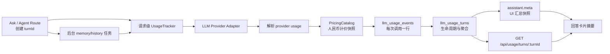

# 对话 Token 成本追踪设计

> 日期：2026-07-29  
> 状态：设计已确认，待实施计划  
> 适用范围：`apps/api`、`apps/web`、`packages/shared-types`  
> 计价基线：[DeepSeek 中文官方计价页](https://api-docs.deepseek.com/zh-cn/quick_start/pricing/)（2026-07-29 核验）

## 1. 背景

当前项目已经在普通问答的部分路径读取最近一次 LLM 调用的 token usage，并将 usage 透传给 Langfuse。
但这套机制不能回答“这一轮 Agent 一共花了多少 Token、钱花在哪个阶段、缓存命中了多少”：

- `llmService.ts` 的 `lastCallMeta` 是进程级可变单例，并发请求存在串账风险；
- 普通问答只保留 prompt / completion / total，丢弃 DeepSeek 的缓存命中与未命中字段；
- `agent/llmWithTools.ts` 没有解析 usage，而一次 Agent 请求会触发 planner、N 次 loop、最终回答和反思等多次 LLM 调用；
- 记忆提取、历史摘要等后台任务在回答返回后继续消耗 Token，当前无法归属到触发它们的对话轮次；
- 会话消息没有可持久化的本轮成本汇总，刷新后无法还原；
- Langfuse 适合链路观测，但本地 UI 和可查询的成本事实不能依赖它是否配置。

本设计建立一套本地、请求级、可持久化的 Token 成本追踪机制，并在每条回答卡片中展示。

## 2. 目标

1. 每轮 Ask / Agent 都有稳定 `turnId`，能关联该轮触发的全部前台与后台 LLM 调用。
2. 每次 LLM 调用记录实际模型、阶段、Token、缓存命中、耗时、状态和人民币成本。
3. Agent 的 planner、每次 loop、final、reflection、后台 memory/history 成本可以分项分析。
4. 回答卡片默认显示本轮摘要，展开后可查看阶段和调用级明细。
5. 回答返回时后台任务尚未结束，卡片显示“成本结算中”；后台完成后更新最终金额。
6. DeepSeek 按官方人民币单价区分缓存命中输入、未命中输入和输出。
7. 价格按调用发生时保存快照；未来调价不重算历史金额。
8. 并发请求不串账，缺失 usage 或单价时不伪装成零成本。
9. 删除会话时同步删除该会话对应的成本轮次与调用明细。

## 3. 非目标

- 本期不做全局成本 Dashboard、日/月报或预算告警；规范化数据表为后续能力提供基础。
- 本期不做调用限额、熔断或“超过预算自动停止 Agent”。
- 本期不自动抓取 DeepSeek 官网价格；价格通过版本化配置维护。
- 本期不计 embedding 调用成本，只统计对话链路中的生成式 LLM 调用。
- 本期不保存 prompt、回答、reasoning、工具结果或请求头到 usage 表。
- 本期不保证与供应商账单分毫一致；以 API 返回的 usage 和调用时价格快照做可复算的观测级成本。
- 本期不把本地 Ollama 推理记成 `¥0`；未配置本地成本模型时只展示 Token，金额为“单价未配置”。

## 4. 已确认的产品决策

### 4.1 展示位置

采用“回答卡片内展开”：

- 默认摘要行：本轮 Token、缓存命中率、LLM 调用次数、人民币成本；
- 点击摘要行后在卡片内展开；
- 展开后先按阶段聚合，`agent_loop` 等多调用阶段可继续展开到单次调用；
- 不增加常驻成本侧栏。

### 4.2 展示密度

采用诊断摘要：

```text
18.4k tokens · 缓存 63.6% · 9 次调用 · ¥0.0113
```

后台任务未完成时：

```text
18.4k tokens · 缓存 63.6% · 9 次调用 · ¥0.0113 · 成本结算中
```

存在不完整 usage 或未知单价时必须显式标记：

```text
部分成本 ¥0.0113 · 1 次调用缺少 usage
```

### 4.3 后台成本归属

记忆提取、历史摘要等由本轮触发的后台 LLM 调用计入本轮。

回答不等待后台任务。前端先显示初步汇总，通过轮询获取最终结算结果。

### 4.4 删除语义

删除会话时，在同一数据库事务中删除：

- `messages`
- `llm_usage_events`
- `llm_usage_turns`
- `conversations`

无状态 MCP 调用没有 conversation 归属，不受“删除会话”操作影响；删除项目数据时应同时清理该项目的 usage 数据。

## 5. 总体架构



核心原则：

- `llm_usage_events` 是调用级事实源；
- `llm_usage_turns` 是轮次生命周期和聚合事实；
- assistant message `meta` 是面向会话恢复的 UI 缓存副本；
- Langfuse 继续接收 usage，但不是本地成本功能的依赖；
- 不继续使用进程级 `lastCallMeta` 做请求归属。

## 6. 请求级 UsageTracker

### 6.1 显式传递，不使用全局上下文

每个 Ask / Agent 路由在解析项目与会话后创建一个 `UsageTracker`。所有会触发 LLM 的函数显式接收
`usageContext`：

```ts
interface LlmUsageContext {
  tracker: UsageTracker
  stage: LlmUsageStage
}
```

选择显式传递而不是 `AsyncLocalStorage`，原因是：

- 后台 fire-and-forget 任务需要明确继承哪个 turn；
- 单测可直接注入 fake tracker；
- stage 标签由调用方决定，显式参数更容易审查；
- 避免异步边界变化后出现隐式归属错误。

低层 LLM 函数保持原有业务返回类型，通过可选 `usageContext` 上报 usage，避免所有调用方改成解包
`{ value, usage }`：

```ts
callChatCompletion(messages, {
  signal,
  usage: { tracker, stage: 'ask.answer' },
})
```

Agent 已有 options 对象，直接增加 `usage`：

```ts
callChatCompletionWithTools(messages, tools, {
  ...llmOptions,
  usage: { tracker, stage: 'agent.loop' },
})
```

### 6.2 Tracker 生命周期

```text
collecting
  ├─ 主链路调用持续记录
  ├─ registerBackground() 增加 pendingJobs
  └─ interactiveDone()
       ├─ pendingJobs = 0 -> settled
       └─ pendingJobs > 0 -> pending

pending
  └─ 每个后台任务 finally 调 backgroundDone()
       └─ pendingJobs = 0 -> settled
```

如果用户中断：

- turn 标记 `aborted`；
- 已经收到的 usage 照常记录；
- 没有 usage 的中断调用记录为 `aborted + usage_source=missing`；
- 默认不再启动记忆提取等回答后任务；
- 即使没有 assistant message，usage turn/event 仍保留，供成本分析。

### 6.3 后台任务句柄

后台任务必须先注册，再让主链路进入 `pending`，避免“主链路已结算、后台任务随后才登记”的竞态：

```ts
const job = tracker.registerBackground('background.memory_extract')
void generateMemoriesFromTurn(..., job.usageContext)
  .finally(() => job.done())
```

所有后台任务必须在 `finally` 中释放计数。任务失败不应让 turn 永远停在“结算中”。

## 7. Stage 分类

第一版使用受控字符串联合类型：

```ts
type LlmUsageStage =
  | 'ask.intent'
  | 'ask.question_plan'
  | 'ask.doc_validation'
  | 'ask.answer'
  | 'ask.reflection'
  | 'ask.reflection_retry'
  | 'agent.planner'
  | 'agent.loop'
  | 'agent.reflection'
  | 'agent.reflection_retry'
  | 'agent.final'
  | 'background.memory_extract'
  | 'background.history_compact'
```

规则：

- 同一 stage 的多次调用使用 `stageCallIndex` 区分；
- `agent.loop` 每轮都记录，不能只记录最终一次；
- judge 使用独立模型时记录真实 provider/model；
- `reasoning_tokens` 是 output 的子集，只做诊断展示，不再次计费；
- 后续新增 LLM 调用必须选择或新增 stage，不能用无语义的 `other` 长期兜底。

## 8. Provider usage 统一类型

在 `packages/shared-types` 增加：

```ts
interface LlmTokenUsage {
  promptTokens?: number
  cacheHitTokens?: number
  cacheMissTokens?: number
  completionTokens?: number
  reasoningTokens?: number
  totalTokens?: number
}

type UsageSource = 'provider' | 'estimated' | 'missing'

interface LlmPricingSnapshot {
  currency: 'CNY'
  canonicalModel: string
  inputCacheHitNanoCnyPerToken: number
  inputCacheMissNanoCnyPerToken: number
  outputNanoCnyPerToken: number
  catalogVersion: string
  sourceUrl: string
  verifiedAt: string
}

interface LlmCallUsage {
  id: string
  turnId: string
  stage: LlmUsageStage
  stageCallIndex: number
  provider: LlmProvider
  model: string
  canonicalModel: string
  status: 'success' | 'error' | 'aborted' | 'usage_missing'
  usageSource: UsageSource
  tokens: LlmTokenUsage
  pricing?: LlmPricingSnapshot
  cacheHitCostNanoCny?: number
  cacheMissCostNanoCny?: number
  outputCostNanoCny?: number
  totalCostNanoCny?: number
  latencyMs: number
  errorKind?: 'timeout' | 'http_4xx' | 'http_5xx' | 'aborted' | 'network' | 'unknown'
  createdAt: number
}
```

usage 表中不保存原始错误响应。`errorKind` 只存受控枚举，避免响应内容或密钥进入观测数据库。

## 9. DeepSeek usage 与人民币计价

### 9.1 官方价格

2026-07-29 核验的人民币价格（每百万 Token）：

| 模型 | 缓存命中输入 | 缓存未命中输入 | 输出 |
|---|---:|---:|---:|
| `deepseek-v4-flash` | ¥0.02 | ¥1 | ¥2 |
| `deepseek-v4-pro` | ¥0.025 | ¥3 | ¥6 |

来源：[DeepSeek 模型 & 价格](https://api-docs.deepseek.com/zh-cn/quick_start/pricing/)。

DeepSeek 上下文缓存默认开启，API usage 会返回：

- `prompt_cache_hit_tokens`
- `prompt_cache_miss_tokens`
- `prompt_tokens`
- `completion_tokens`
- `total_tokens`

缓存规则与字段来源：[DeepSeek 上下文硬盘缓存](https://api-docs.deepseek.com/zh-cn/guides/kv_cache)。

### 9.2 精度

成本使用 nano-CNY 整数（`1 CNY = 1,000,000,000 nano-CNY`），避免极低缓存命中价被四舍五入成零。

每 Token 的整数费率：

| 模型 | hit nano-CNY/token | miss nano-CNY/token | output nano-CNY/token |
|---|---:|---:|---:|
| `deepseek-v4-flash` | 20 | 1000 | 2000 |
| `deepseek-v4-pro` | 25 | 3000 | 6000 |

计算：

```ts
cacheHitCost = cacheHitTokens * inputCacheHitNanoCnyPerToken
cacheMissCost = cacheMissTokens * inputCacheMissNanoCnyPerToken
outputCost = completionTokens * outputNanoCnyPerToken
totalCost = cacheHitCost + cacheMissCost + outputCost
```

UI 展示时除以 `1e9`。金额格式最多保留 6 位小数并移除尾零；只在实际成本为 0 时显示 `¥0`。

### 9.3 模型别名

价格目录将以下旧别名 canonicalize 为 `deepseek-v4-flash`：

- `deepseek-chat`：非思考模式；
- `deepseek-reasoner`：思考模式。

这是历史兼容，不应鼓励继续配置旧别名。官方已于 2026-07-24 弃用这两个模型名，项目运行配置应迁移到
`deepseek-v4-flash` / `deepseek-v4-pro`。

### 9.4 价格目录与快照

新增 `PricingCatalog`：

- 内置经过测试的 DeepSeek CNY 默认价；
- 支持 `LLM_PRICING_CNY_JSON` 覆盖或补充自定义模型；
- 每次调用保存实际使用的价格快照；
- 价格目录必须有 `catalogVersion`、`sourceUrl`、`verifiedAt`；
- 未匹配到单价时 Token 正常记录，成本字段为 `null`，`unknownPricingCalls + 1`；
- 不自动从网页抓价。

### 9.5 缺失缓存字段

若有 `prompt_tokens`，但代理未返回 hit/miss：

- `cacheHitTokens = 0`
- `cacheMissTokens = promptTokens`
- `usageSource = estimated`
- 成本是“全部未命中”的保守上界；
- UI 显示“估算”，不能显示为精确账单。

若 usage 整体缺失：

- `usageSource = missing`
- Token 和成本字段为空；
- 记录模型、阶段、耗时和调用状态；
- 汇总中的 `usageMissingCalls + 1`。

校验：

```text
prompt_tokens 应等于 cache_hit_tokens + cache_miss_tokens
total_tokens 应等于 prompt_tokens + completion_tokens
reasoning_tokens 不得大于 completion_tokens
```

供应商数据不一致时保留原值、记录 warning，并将该调用标记为 partial；不要静默改写供应商数据。

## 10. 数据库设计

SQLite schema 升级到 v6。

### 10.1 `llm_usage_turns`

```sql
CREATE TABLE llm_usage_turns (
  turn_id                   TEXT PRIMARY KEY,
  project_id                TEXT NOT NULL,
  conversation_id           TEXT,
  assistant_message_id      TEXT,
  pipeline                  TEXT NOT NULL,
  source                    TEXT NOT NULL DEFAULT 'web',
  status                    TEXT NOT NULL,
  pending_jobs              INTEGER NOT NULL DEFAULT 0,
  call_count                INTEGER NOT NULL DEFAULT 0,
  success_call_count        INTEGER NOT NULL DEFAULT 0,
  failed_call_count         INTEGER NOT NULL DEFAULT 0,
  usage_missing_calls       INTEGER NOT NULL DEFAULT 0,
  unknown_pricing_calls     INTEGER NOT NULL DEFAULT 0,
  prompt_tokens             INTEGER NOT NULL DEFAULT 0,
  cache_hit_tokens          INTEGER NOT NULL DEFAULT 0,
  cache_miss_tokens         INTEGER NOT NULL DEFAULT 0,
  completion_tokens         INTEGER NOT NULL DEFAULT 0,
  reasoning_tokens          INTEGER NOT NULL DEFAULT 0,
  total_tokens              INTEGER NOT NULL DEFAULT 0,
  known_cost_nano_cny       INTEGER NOT NULL DEFAULT 0,
  created_at                INTEGER NOT NULL,
  updated_at                INTEGER NOT NULL,
  settled_at                INTEGER
);

CREATE INDEX idx_usage_turn_project
  ON llm_usage_turns(project_id, created_at DESC);

CREATE INDEX idx_usage_turn_conversation
  ON llm_usage_turns(conversation_id, created_at);
```

`known_cost_nano_cny` 是已知单价调用的成本和。若 `unknown_pricing_calls > 0` 或 `usage_missing_calls > 0`，
它只是已知部分，UI 必须显示“部分成本”，不能当作完整总价。

### 10.2 `llm_usage_events`

```sql
CREATE TABLE llm_usage_events (
  id                         TEXT PRIMARY KEY,
  turn_id                    TEXT NOT NULL,
  stage                      TEXT NOT NULL,
  stage_call_index           INTEGER NOT NULL,
  provider                   TEXT NOT NULL,
  model                      TEXT NOT NULL,
  canonical_model            TEXT NOT NULL,
  status                     TEXT NOT NULL,
  usage_source               TEXT NOT NULL,
  prompt_tokens              INTEGER,
  cache_hit_tokens           INTEGER,
  cache_miss_tokens          INTEGER,
  completion_tokens          INTEGER,
  reasoning_tokens           INTEGER,
  total_tokens               INTEGER,
  cache_hit_cost_nano_cny    INTEGER,
  cache_miss_cost_nano_cny   INTEGER,
  output_cost_nano_cny       INTEGER,
  total_cost_nano_cny        INTEGER,
  pricing_snapshot_json      TEXT,
  latency_ms                 INTEGER NOT NULL,
  error_kind                 TEXT,
  created_at                 INTEGER NOT NULL
);

CREATE UNIQUE INDEX idx_usage_event_stage_call
  ON llm_usage_events(turn_id, stage, stage_call_index);

CREATE INDEX idx_usage_event_turn
  ON llm_usage_events(turn_id, created_at);

CREATE INDEX idx_usage_event_model_stage
  ON llm_usage_events(canonical_model, stage, created_at DESC);
```

当前项目的 SQLite 层未依赖外键级联，删除语义继续使用显式事务，避免只删 conversation 留下孤儿 usage。

### 10.3 写入与聚合

记录一次调用时，在同一事务中：

1. `INSERT` event；
2. 增量更新 turn 的调用数、Token 和已知成本；
3. 更新 `updated_at`。

`UsageTracker` 的一次调用只能完成一次。唯一索引防止重入重复计费。

进入 `settled` 前，从 events 重新聚合并覆盖 turn 汇总，作为最终一致性校验与并发增量修复。验收必须断言：

```text
turn 汇总 = 该 turn 所有 event 的逐字段求和
```

### 10.4 message meta

assistant message `meta` 增加：

```ts
interface TurnUsageSummary {
  turnId: string
  status: 'collecting' | 'pending' | 'settled' | 'aborted'
  settled: boolean
  partial: boolean
  callCount: number
  failedCallCount: number
  usageMissingCalls: number
  unknownPricingCalls: number
  promptTokens: number
  cacheHitTokens: number
  cacheMissTokens: number
  completionTokens: number
  reasoningTokens: number
  totalTokens: number
  cacheHitRate?: number
  knownCostNanoCny: number
  updatedAt: number
}
```

`meta.tokenUsageSummary` 只存汇总和 `turnId`，不复制调用事件。

需要为 conversation store 增加：

- `updateMessageMeta(messageId, patch)`；
- 在事务内安全合并现有 JSON meta；
- assistant 消息落库后用其 id 回填 `llm_usage_turns.assistant_message_id`；
- settle 后更新最终 `tokenUsageSummary`。

## 11. LLM Adapter 改造

### 11.1 普通问答

`llmService.ts` 需要：

- 扩充 DeepSeek non-stream JSON usage 类型；
- 扩充 stream 最后一个 chunk 的 usage 类型；
- 解析 hit/miss/reasoning；
- 在实际 provider 调用的最低层记录 usage，确保 fallback 后记录真实模型；
- 用 `usageContext` 归属 turn/stage；
- 删除业务路径对 `getLastLlmCallMeta()` 的依赖；
- 完成迁移后移除 `lastCallMeta` 单例。

### 11.2 Agent

`agent/llmWithTools.ts` 需要：

- 为 OpenAI-compatible response 增加 usage 解析；
- 为 Ollama response 解析 `prompt_eval_count` / `eval_count`；
- 每次 planner、loop、reflection、retry、final 调用都记录；
- Agent 主循环向每次调用传相同 tracker、不同 stage；
- stage 内的 `stageCallIndex` 由 tracker 原子分配。

### 11.3 Judge 与独立模型

`answerJudge.ts` 可能走独立 `JUDGE_LLM_*`。事件必须记录独立模型和 provider。

如果该模型没有价格配置：

- 仍记录 Token；
- 该调用金额未知；
- 本轮显示“部分成本”；
- 不错误套用主模型价格。

### 11.4 后台任务

`generateMemoriesFromTurn` 和 `compactHistory` 增加可选 `usageContext`。

路由负责注册后台句柄并传入；服务本身继续 best-effort，不向主问答抛错。

Embedding、向量回填不进入本期 LLM usage 表。

## 12. API 与 SSE 契约

### 12.1 AskResponse

普通非 SSE `/api/ask` 在响应增加：

```ts
turnId?: string
tokenUsageSummary?: TurnUsageSummary
```

MCP 无状态问答也生成 usage turn，但不创建 conversation/message；响应仍可携带 `turnId` 和初步汇总。

### 12.2 SSE `done`

Ask 和 Agent 的 `done.data` 增加：

```ts
{
  turnId: string
  tokenUsageSummary: TurnUsageSummary
}
```

主回答完成时：

- 如果没有后台任务，summary 已 `settled=true`；
- 如果已有已注册后台任务，summary 为 `status='pending'`、`settled=false`；
- SSE 不为等待后台任务而保持连接。

### 12.3 查询端点

```http
GET /api/usage/turns/:turnId
```

响应：

```ts
interface TurnUsageDetailResponse {
  summary: TurnUsageSummary
  events: LlmCallUsage[]
}
```

约束：

- 必须登录；
- turn 的 `project_id` 必须等于当前项目；
- 不存在或跨项目统一返回 404，避免枚举其他项目 turn；
- events 按 `createdAt, stageCallIndex` 稳定排序；
- endpoint 只返回受控 usage 字段，不返回 prompt 或错误原文。

后续数据量增大再增加 `?includeEvents=false`，第一版每轮事件数有限，可直接返回完整明细。

### 12.4 前端轮询

收到 `settled=false` 后：

- 每 1.5 秒请求一次 usage endpoint；
- settled 后停止；
- 页面离开或组件卸载时取消；
- 最长主动轮询 30 秒；
- 超时后保持“结算中，可刷新查看”，不影响回答；
- 从历史会话恢复到 unsettled summary 时重新轮询；
- 轮询失败不覆盖已有初步数据。

## 13. Web UI

### 13.1 类型

`ConversationTurn` 增加：

```ts
tokenUsageSummary?: TurnUsageSummary
tokenUsageEvents?: LlmCallUsage[]
tokenUsageExpanded?: boolean
tokenUsageLoading?: boolean
```

`useConversation.messagesToTurns()` 从 assistant message meta 恢复 summary。

### 13.2 组件边界

新增独立组件 `TokenUsagePanel.vue`，避免继续膨胀 `AnswerView.vue`。

输入：

```ts
summary: TurnUsageSummary
events?: LlmCallUsage[]
loading: boolean
```

输出：

- `expand`
- `retry`

组件职责：

- 格式化 Token、命中率和 nano-CNY；
- 渲染 settled / pending / partial / unknown 状态；
- 聚合 events 到 stage 行；
- 展开 stage 查看单次调用；
- 不负责 fetch，数据请求留在 composable。

新增 `useTokenUsage.ts`：

- 按 turnId 获取明细；
- 管理轮询、取消和 30 秒上限；
- 更新当前 turn；
- 避免同一 turn 多个重复 poller。

### 13.3 显示规则

摘要：

- Token：优先 `totalTokens`；
- 缓存命中率：`hit / (hit + miss)`，输入为 0 时不显示；
- 调用数：包括成功、失败和缺失 usage 的 LLM 调用；
- 金额：完整时 `¥x`，未知调用存在时显示“部分成本 ¥x”；
- settled=false 显示旋转状态点与“成本结算中”；
- partial=true 显示警告图标，可在展开区查看原因。

调用明细：

| 阶段 | 模型 | 输入 hit/miss | 输出 | reasoning | 耗时 | 成本 | 状态 |
|---|---|---:|---:|---:|---:|---:|---|

`reasoning` 只展示为 output 子集，不再计费。

## 14. 隐私与安全

usage 表允许保存：

- turn / project / conversation / message 标识；
- pipeline、stage、provider、model；
- Token、成本、价格快照；
- 延迟、受控状态和错误类别。

禁止保存：

- prompt；
- 回答；
- reasoning 内容；
- 工具参数和结果；
- API Key、Authorization header；
- 供应商原始错误响应；
- 用户隐私信息。

查询端点使用当前项目归属校验。删除会话与 usage 删除在同一事务完成。

## 15. 错误处理

| 场景 | 行为 |
|---|---|
| usage 完整 | 精确记录并计价 |
| 缺缓存拆分 | 全按未命中估算成本上界，标 `estimated` |
| usage 全缺失 | Token/成本未知，调用仍计数 |
| 未知模型单价 | Token 可见，金额标“单价未配置” |
| error / abort | 保存已有 usage；无 usage 时标 missing |
| pricing 配置非法 | 启动时告警并忽略该模型价格，不影响 LLM 调用 |
| usage DB 写失败 | 日志 + trace；不得让问答失败 |
| 后台任务失败 | `finally` 释放 pending；turn settled 但 partial |
| 前端轮询失败 | 保留初步汇总，允许手动重试 |

## 16. 测试策略

### 16.1 PricingCatalog 单测

- V4 Flash hit / miss / output 的 nano-CNY 精确值；
- V4 Pro 精确值；
- 多分项求和；
- `deepseek-chat` / `deepseek-reasoner` alias；
- 自定义价格覆盖；
- 未知模型返回 `null`；
- 极小成本不被舍入为零；
- reasoning 不重复收费。

### 16.2 Adapter 单测

- DeepSeek 非流式 usage；
- DeepSeek 流式末帧 usage；
- hit + miss 字段解析；
- 缓存字段缺失的 estimated 行为；
- usage 全缺失；
- Ollama `prompt_eval_count` / `eval_count`；
- HTTP error、timeout、abort；
- 独立 judge 模型；
- fallback 后记录实际 provider/model。

### 16.3 UsageTracker 单测

- 单轮多调用聚合；
- `agent.loop` call index 递增；
- 两个并发 tracker 不串账；
- 主链路完成、无后台任务直接 settled；
- 后台任务 pending → settled；
- 后台失败仍释放 pending；
- aborted；
- 一次调用 finish 两次不重复计费；
- events 求和等于 turn 汇总。

### 16.4 DB 与路由测试

- v6 migration 可重入；
- turn/event 插入与索引；
- 同事务 event + aggregate；
- settle 前最终重算；
- assistant message id 回填；
- message meta 合并不覆盖 followUp/steps/evidence 等既有字段；
- GET usage 正常、未知 turn、跨项目 404、未登录 401；
- 删除会话同步删除 usage；
- 删除其他会话不误删；
- MCP 无 conversation 的 usage 可记录。

### 16.5 Ask / Agent 路由测试

- Ask 非 SSE 返回 turnId/summary；
- Ask SSE done 返回初步 summary；
- Agent planner + N loop + final 聚合；
- reflection / retry 单独分阶段；
- memory/history 后台成本计入原 turn；
- SSE 不等待后台任务；
- abort 后不启动回答后任务；
- Langfuse 未配置时本地 usage 仍工作。

### 16.6 Web 测试

- 完整摘要；
- 缓存命中率；
- pending 状态；
- partial / unknown pricing；
- 展开阶段与单次调用；
- settled 后停止轮询；
- 30 秒停止；
- 组件卸载取消；
- 刷新会话从 meta 恢复；
- 暗色模式与移动端布局。

### 16.7 DeepSeek 活体验收

使用真实 `deepseek-v4-flash`：

1. 连续发送具有稳定公共前缀的多轮请求；
2. 验证第二轮或后续轮 `prompt_cache_hit_tokens > 0`；
3. 人工按官方人民币公式复算每次调用；
4. 对比 event 求和与 turn 汇总；
5. 跑一轮 Agent，确认 planner + loop × N + reflection/final + memory 都归入同一 turn；
6. 两个并发请求确认 turn 不串账；
7. 删除会话后确认对应 usage 行数为 0。

活体验收记录模型名、官方价格版本、时间、调用数、hit/miss/output、计算公式和最终金额，不记录 prompt 内容。

## 17. 分阶段交付

### 阶段 1：契约与计价

- shared types；
- PricingCatalog；
- DeepSeek CNY 默认价与 alias；
- formatter；
- 单测。

完成门槛：价格公式和精度测试全绿。

### 阶段 2：存储地基

- SQLite v6；
- turn/event store；
- tracker 生命周期；
- 最终重算；
- 删除事务；
- DB/Tracker 测试。

完成门槛：并发 tracker 不串账，events 求和等于 turn。

### 阶段 3：全链路采集

- `llmService` usage；
- `llmWithTools` usage；
- Ask / Agent 各 stage；
- judge；
- memory/history 后台；
- 淘汰 `lastCallMeta`。

完成门槛：离线路由测试证明一轮 Agent 全调用都进入同一 turn。

### 阶段 4：API 与 UI

- AskResponse / AgentEvent additive 字段；
- usage 查询路由；
- assistant meta；
- polling composable；
- `TokenUsagePanel.vue`；
- Web 单测、typecheck、build、布局回归。

完成门槛：实时回答和刷新历史都能展示同一份汇总。

### 阶段 5：DeepSeek 活体验收

- 真实缓存命中；
- 官方公式人工复算；
- 后台结算；
- 并发隔离；
- 删除语义；
- 文档回填实测数字。

完成门槛：完整验收记录进入项目文档，所有自动化门禁通过。

## 18. 总体验收标准

1. 同一 Agent 轮次中 planner + N 次 loop + final/reflection + 后台 memory/history 全部关联同一 `turnId`。
2. `llm_usage_turns` 汇总与该 turn 下 events 逐字段求和完全一致。
3. 两个并发请求的 usage 不互相污染。
4. DeepSeek hit/miss/output 按官方人民币价格可人工复算。
5. usage 缺失或单价未知时 UI 不显示为零成本。
6. 回答不等待后台任务，后台完成后 summary 由 pending 变 settled。
7. 刷新会话后成本摘要仍存在。
8. 删除会话后对应 turns/events 为 0 行。
9. usage 表不含 prompt、回答、reasoning、工具结果或密钥。
10. API、Web、MCP 现有测试与全仓 typecheck/build 不回退。

## 19. 实施注意事项

- 当前主分支已增加 Agent reflection/evidence 流程，stage 接线必须覆盖正常回答、反思重答和强制收尾三条出口。
- `AnswerView.vue` 已承载较多逻辑，成本 UI 与轮询必须拆成组件/composable。
- message meta 已包含 followUp、steps、planSteps、reflection 等字段；更新 summary 时必须做 JSON patch，不能整段覆盖。
- 历史摘要在 `buildHistoryWindow` 中以 fire-and-forget 触发，tracker 必须在调用它之前创建并传入后台句柄。
- 记忆提取同样是 best-effort；无论早退、失败还是异常，都必须释放后台计数。
- 成本追踪是观测增强，任何存储或计价异常都不得阻断用户回答。

## 20. 官方参考

- [DeepSeek 模型 & 价格（人民币）](https://api-docs.deepseek.com/zh-cn/quick_start/pricing/)
- [DeepSeek 上下文硬盘缓存](https://api-docs.deepseek.com/zh-cn/guides/kv_cache)
- [DeepSeek Chat Completion API](https://api-docs.deepseek.com/api/create-chat-completion/)

